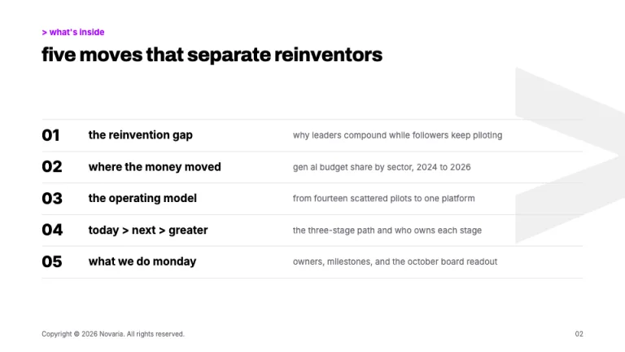
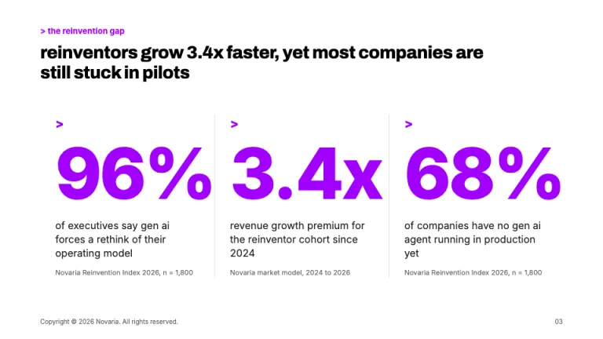
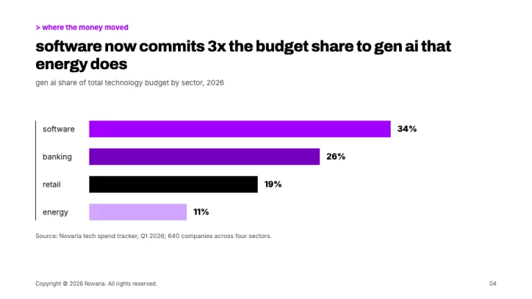
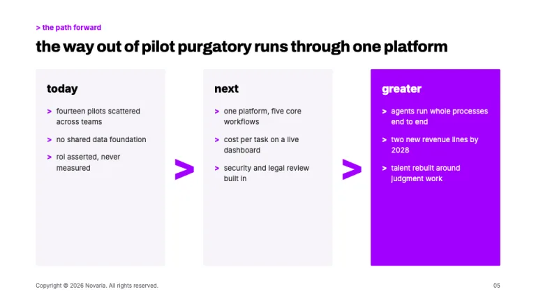
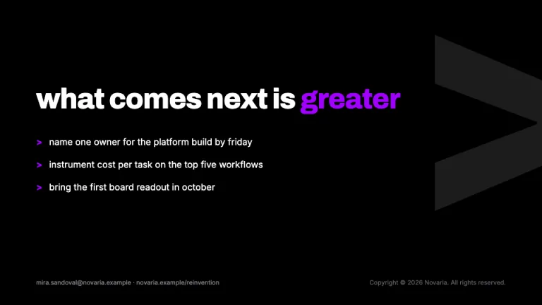

[← All prompts](../README.md) · [Live site](https://slidespeak.co/slide-design-prompts) · [SlideSpeak](https://slidespeak.co)

# Accenture Style

> Purple, black, and greater than

The closest thing to an Accenture PowerPoint template you can prompt into existence: black covers with a giant purple > glyph, oversized #a100ff stat callouts, and hairline-ruled agendas for a slide deck that reads like a tech-consulting report. An unofficial homage inspired by Accenture's public visual style. Not affiliated with, endorsed by, or sponsored by Accenture.

**Category:** Consulting &nbsp;·&nbsp; **Style:** Corporate, Bold &nbsp;·&nbsp; **Mode:** Light &nbsp;·&nbsp; **Fonts:** Archivo + Inter

<table>
    <tr>
      <td align="center" width="33%"><br><sub>Title</sub></td>
      <td align="center" width="33%"><br><sub>Agenda</sub></td>
      <td align="center" width="33%"><br><sub>Big stat callouts</sub></td>
    </tr>
    <tr>
      <td align="center" width="33%"><br><sub>Bar chart</sub></td>
      <td align="center" width="33%"><br><sub>Greater-than framework</sub></td>
      <td align="center" width="33%"><br><sub>Closing call to action</sub></td>
    </tr>
</table>

## The prompt

Copy the prompt below into **ChatGPT**, **Claude**, or any AI chat — or grab the raw [`PROMPT.md`](./PROMPT.md). It asks what your presentation is about first, then applies the design to every slide.

```text
Create a presentation in the 'Accenture Style' theme, an unofficial homage to the purple-and-black look of the big technology consultancy. Interior slides are white (#ffffff); covers and section dividers are full-bleed black (#000000). Typography: headlines in 'Archivo' at 700 to 800 weight, sentence case with a lowercase-leaning voice, 44 to 64px, letter-spacing -0.02em, line-height 1.05 to 1.15; body in 'Inter', 15 to 18px near-black (#202020), left-aligned, max width around 60 characters; kicker labels 12 to 13px Archivo 700 in purple (#a100ff), prefixed '> '. Color discipline is absolute: purple #a100ff is the only accent against black, white, and gray #66646e; deep purple #7500c0 and light tint #d2a5ff appear only inside charts. The greater-than sign is the signature motif, a bold text glyph deployed three ways: a giant cropped background > (400 to 700px, #a100ff on black covers, 6 to 8 percent black on white slides, bleeding off the right edge), small purple > markers before list items, and a > prefix on kickers and CTAs. Title slide: black, giant purple >, a thin 2px #a100ff rule above a white Archivo 800 headline, presenter and date in 13px gray-white, wordmark lockup bottom-left ending in >. Agenda: five rows split by 1px #e4e1ea hairlines, each led by an Archivo 800 two-digit numeral (01 to 05). Signature exhibit: oversized stat callouts, numerals 110 to 160px Archivo 800 in #a100ff over a one-line caption and an 11px #66646e source line, three per slide max, split by vertical hairlines. Charts are monochrome purple in series order #a100ff, #7500c0, #000000, #d2a5ff: flat bars, no gridlines, one 1px black baseline, bold direct value labels, headlines that state the takeaway as a full sentence. Framework slides read today > next > greater, flat #f6f4f9 panels (2px radius) joined by 64px purple > glyphs, one panel inverted to solid #a100ff with white text. Footer on every interior slide: 10px #66646e, copyright left, page number right. Closer: black, a massive white statement with the final word in purple, next steps prefixed by purple >. Strictly avoid: any second accent hue (blue, teal, orange, green), purple gradients, glows or glassmorphism, serif or rounded fonts, Title Case or all-caps headlines, chevron icons or arrows in place of a true bold > glyph, rounded cards with drop shadows, lavender or pastel purple page backgrounds, chart legends, gridlines, 3D or donut decoration, full-color stock photography, small timid stat numbers, and claiming affiliation with Accenture.

Use this theme for my slides. Ask me what the presentation is about first, then apply the theme to every slide.
```

**[Open ChatGPT ↗](https://chatgpt.com/)** &nbsp;·&nbsp; **[Open Claude ↗](https://claude.ai/new)** &nbsp;·&nbsp; **[Generate a finished deck with SlideSpeak ↗](https://app.slidespeak.co/presentation?utm_source=github&utm_medium=referral&utm_campaign=slide-design-prompts)**

## Palette

| Role | Hex |
| --- | --- |
| Background | `#ffffff` |
| Surface / panel | `#f6f4f9` |
| Border | `#e4e1ea` |
| Primary accent | `#a100ff` |
| Primary (soft tint) | `#f3e6ff` |
| Text on primary | `#ffffff` |
| Heading text | `#000000` |
| Body text | `#202020` |
| Muted text | `#66646e` |

**Chart series:** `#a100ff` `#7500c0` `#000000` `#d2a5ff`

## Fonts

- **Archivo** (heading, Google Fonts)
- **Inter** (supporting, Google Fonts)

---

<sub>Part of [SlideSpeak Slide Design Prompts](../../README.md) · MIT licensed</sub>
