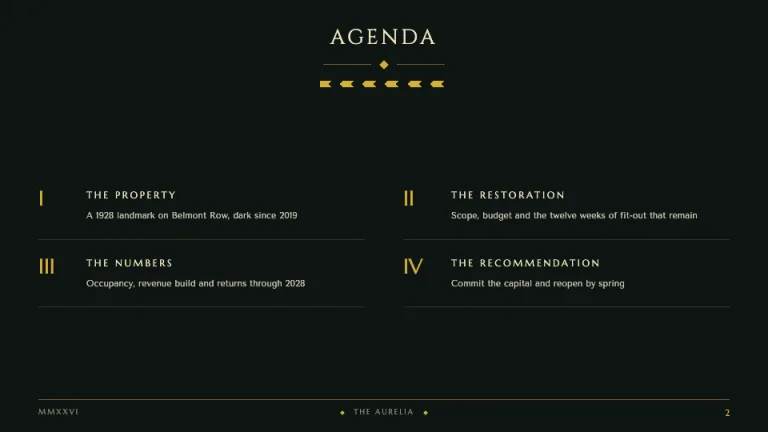
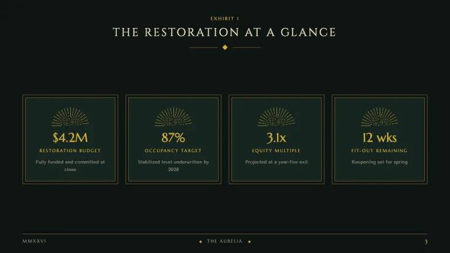
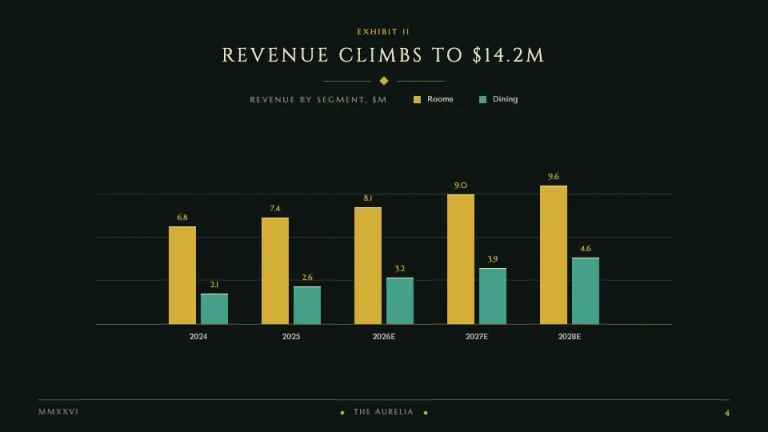
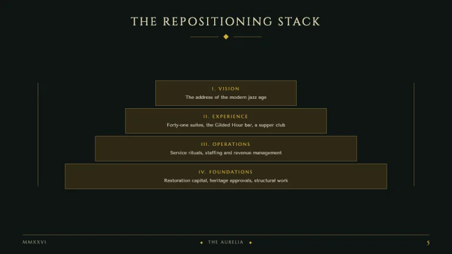
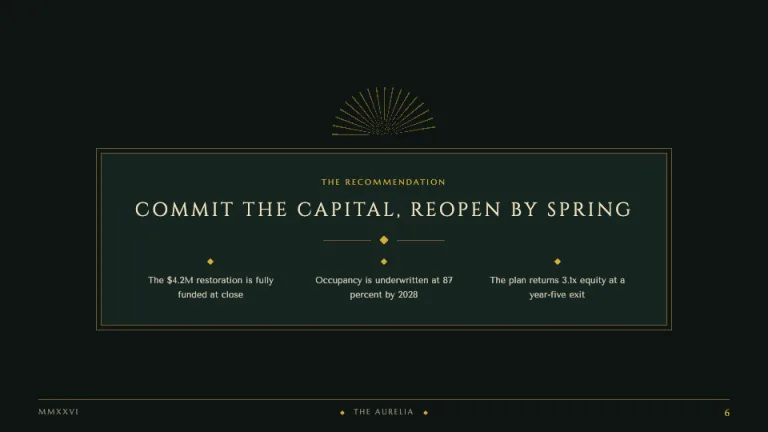

[← All prompts](../README.md) · [Live site](https://slidespeak.co/slide-design-prompts) · [SlideSpeak](https://slidespeak.co)

# Art Deco

> Gold geometry for the modern jazz age

A gatsby presentation theme in deep emerald and flat gold: sunburst fans, double-rule frames and letterspaced Cinzel capitals give this art deco PowerPoint template the discipline of a 1928 skyscraper lobby. Every motif is built from CSS geometry, so nothing reads as costume-party clip art.

**Category:** Creative & portfolio &nbsp;·&nbsp; **Style:** Elegant, Bold, Retro &nbsp;·&nbsp; **Mode:** Dark &nbsp;·&nbsp; **Fonts:** Cinzel + Marcellus + Tenor Sans

<table>
    <tr>
      <td align="center" width="33%"><br><sub>Title</sub></td>
      <td align="center" width="33%"><br><sub>Agenda</sub></td>
      <td align="center" width="33%"><br><sub>KPI dashboard</sub></td>
    </tr>
    <tr>
      <td align="center" width="33%"><br><sub>Bar chart</sub></td>
      <td align="center" width="33%"><br><sub>Ziggurat framework</sub></td>
      <td align="center" width="33%"><br><sub>Closing</sub></td>
    </tr>
</table>

## The prompt

Copy the prompt below into **ChatGPT**, **Claude**, or any AI chat — or grab the raw [`PROMPT.md`](./PROMPT.md). It asks what your presentation is about first, then applies the design to every slide.

```text
Create a presentation in the 'Art Deco' theme, a 1920s jazz-age deck in deep emerald and flat gold. Background: near-black emerald (#0E1512); content panels sit on #16241F with sharp 90-degree corners and a 1px antique-gold border (#6F5B30) plus a second inset hairline 6px inside it, the signature double-rule deco frame. Typography: slide titles in 'Cinzel', uppercase, letter-spacing 0.14em, champagne (#EFE3C0), always centered, with a centered ornament beneath: a 60px hairline in #6F5B30, an 8px rotated-square gold diamond (#D4AF37), another 60px hairline; kickers and labels in 'Marcellus', uppercase, letter-spacing 0.22em, 11 to 13px, gold; body copy and axis labels in 'Tenor Sans' (#C9C3B0); big numerals in 'Cinzel' gold, agenda numbering in Roman numerals (I to IV). The signature motif is a semicircular sunburst fan built with repeating-conic-gradient(from -90deg, #D4AF37 0deg 1.5deg, transparent 1.5deg 10deg), clipped by border-radius, at 35 to 50 percent opacity, placed symmetrically behind or above title blocks, never as an image. Composition is strictly symmetric everywhere. Title slide: the sunburst rising behind a Cinzel title with a Marcellus gold subtitle, wrapped in the double-rule frame with 12px L-shaped gold corner brackets. Agenda: two symmetric columns of Roman-numbered items separated by 1px #3A3322 hairlines, with a chevron zigzag band (135deg gold repeating-linear-gradient stripes mirrored by a 45deg twin) under the title. KPI slides: four fan-arch stat cards whose top edge is a semicircle arch (border-radius 999px 999px 0 0) filled with the sunburst gradient, metric beneath in Cinzel gold. Charts are flat divs: bars in #D4AF37, then #46A08B, #C25E6A, #ADB5B0, each with a 1px #EFE3C0 top cap, gridlines #3A3322, baseline #6F5B30, value callouts in Cinzel gold. Tables: Marcellus gold headers over a double rule (1px #D4AF37 over 1px #6F5B30), body rows split by #3A3322 hairlines, numerals right-aligned. Frameworks use a stepped ziggurat of 3 to 5 centered #2E2816 blocks with #6F5B30 borders, each wider than the one above. Footer: a full-width #6F5B30 hairline, the deck name in Marcellus uppercase #948E76 flanked by two tiny gold diamonds, page number in Cinzel at far right. Keep gold under 10 percent of any slide. Strictly avoid: Broadway novelty lettering and Gatsby party-invitation scripts; metallic gradients, bevels or shadows on gold; feathers, pearls, champagne glasses, confetti, glitter; rounded corners or pill buttons; asymmetric or ragged-left titles; solid gold backgrounds; pure #000000 or pure #FFFFFF; lowercase display headlines; raster sunburst images or emoji; modern blue or purple accents.

Use this theme for my slides. Ask me what the presentation is about first, then apply the theme to every slide.
```

**[Open ChatGPT ↗](https://chatgpt.com/)** &nbsp;·&nbsp; **[Open Claude ↗](https://claude.ai/new)** &nbsp;·&nbsp; **[Generate a finished deck with SlideSpeak ↗](https://app.slidespeak.co/presentation?utm_source=github&utm_medium=referral&utm_campaign=slide-design-prompts)**

## Palette

| Role | Hex |
| --- | --- |
| Background | `#0E1512` |
| Surface / panel | `#16241F` |
| Border | `#6F5B30` |
| Primary accent | `#D4AF37` |
| Primary (soft tint) | `#2E2816` |
| Text on primary | `#1B1508` |
| Heading text | `#EFE3C0` |
| Body text | `#C9C3B0` |
| Muted text | `#948E76` |

**Chart series:** `#D4AF37` `#46A08B` `#C25E6A` `#ADB5B0`

## Fonts

- **Cinzel** (heading, Google Fonts)
- **Marcellus** (supporting, Google Fonts)
- **Tenor Sans** (supporting, Google Fonts)

---

<sub>Part of [SlideSpeak Slide Design Prompts](../../README.md) · MIT licensed</sub>
