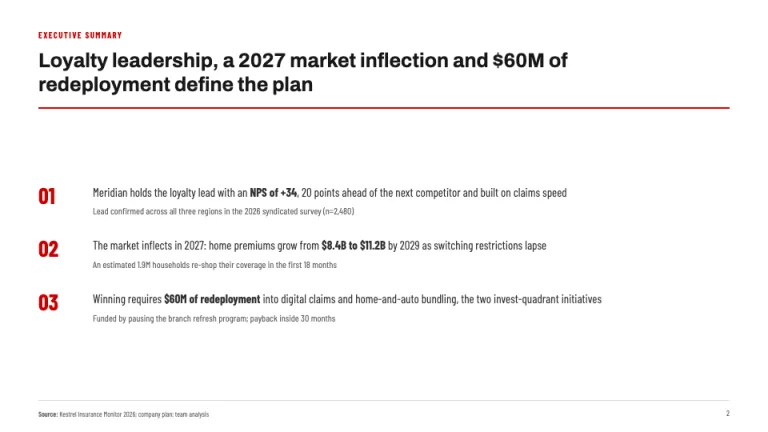
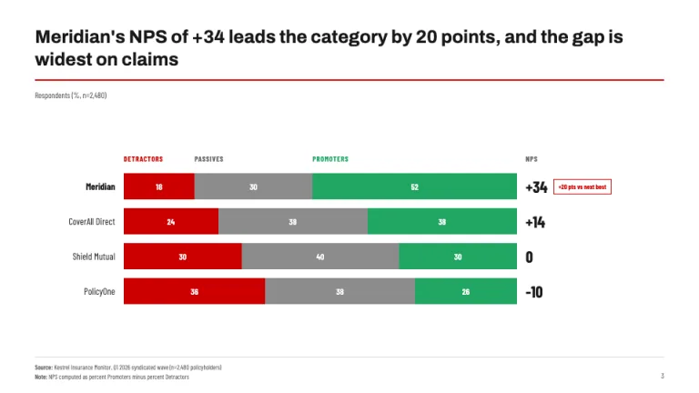
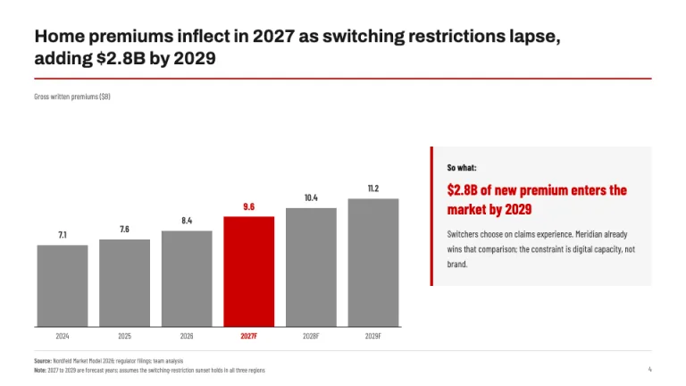
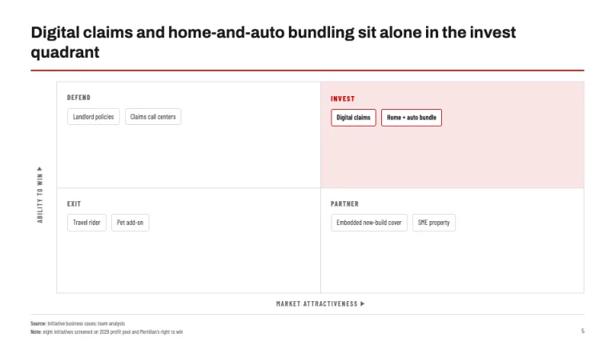
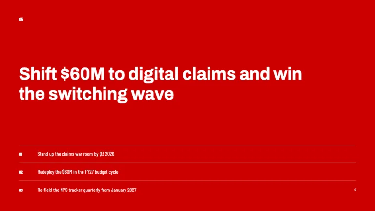

[← All prompts](../README.md) · [Live site](https://slidespeak.co/slide-design-prompts) · [SlideSpeak](https://slidespeak.co)

# Bain Style

> Answer first, red where it counts

A Bain style presentation format for answer-first slides: full-sentence action titles over a red rule, gray charts with one #cc0000 highlight, so-what callout boxes and the signature NPS stacked-bar exhibit. An unofficial homage to the Bain & Company presentation style. Not affiliated with, endorsed by, or connected to Bain & Company.

**Category:** Consulting &nbsp;·&nbsp; **Style:** Corporate, Bold &nbsp;·&nbsp; **Mode:** Light &nbsp;·&nbsp; **Fonts:** Archivo + Barlow Condensed

<table>
    <tr>
      <td align="center" width="33%"><br><sub>Title</sub></td>
      <td align="center" width="33%"><br><sub>Executive summary</sub></td>
      <td align="center" width="33%"><br><sub>NPS exhibit</sub></td>
    </tr>
    <tr>
      <td align="center" width="33%"><br><sub>Market chart + so-what</sub></td>
      <td align="center" width="33%"><br><sub>2x2 framework</sub></td>
      <td align="center" width="33%"><br><sub>Recommendation kicker</sub></td>
    </tr>
</table>

## The prompt

Copy the prompt below into **ChatGPT**, **Claude**, or any AI chat — or grab the raw [`PROMPT.md`](./PROMPT.md). It asks what your presentation is about first, then applies the design to every slide.

```text
Create a presentation in the 'Bain Style' theme, an unofficial homage to the answer-first consulting deck. Background: white (#ffffff) on every content slide. Typography: 'Archivo' (Google Fonts) for titles and body; chart axis labels, table numerics and bar annotations in 'Barlow Condensed' 400/600. The signature header: every content slide opens with a full-sentence action title stating the takeaway, never the topic, in bold Archivo 26 to 30px charcoal (#191919), left-aligned, two lines maximum, over a 2px red (#cc0000) rule spanning the content width. Red #cc0000 is rationed to one highlight per slide (a bar, number or border), never decoration. Title slide: a letterspaced 11px uppercase red eyebrow, an oversized bold title stating the engagement's answer, a thin 2px red keyline, then date and a 'Prepared for' line in gray (#666666). Executive summary: three numbered takeaways with big bold #cc0000 numerals 01/02/03, one bolded key phrase each, sub-lines in #666666, no deep bullets. The signature exhibit is the NPS slide: 100% stacked horizontal bars per competitor split Detractors #cc0000, Passives #8c8c8c, Promoters #21a663, the computed Net Promoter Score as a large bold #191919 number per bar, and a red-outlined delta callout on the leader. Chart discipline: one exhibit per slide; the series proving the title is #cc0000, context series #1f1f1f and #8c8c8c; direct data labels at bar ends; a unit-and-denominator lockup top-left in 12px #666666, such as 'Revenue ($B)'. So-what callout boxes: #f5f5f5 fill, 4px solid #cc0000 left border, a red key stat at 1.5x body size. 2x2 frameworks: 1px #d9d9d9 internal borders, 12px uppercase #666666 axis labels with small arrowheads, the recommended quadrant filled #fae5e5 with a bold #cc0000 label. Tables: bold header row over a 2px #191919 rule, 1px #d9d9d9 row rules, right-aligned Barlow Condensed numerics, deltas in #21a663 or #cc0000, no zebra striping. Kicker slides: full-bleed #cc0000, one white bold statement, 12 words maximum, at 40 to 48px, a small white section number top-left. Footer: 1px #d9d9d9 rule near the bottom, 'Source:' and 'Note:' lines in 10px #666666 bottom-left, page number bottom-right; every data slide carries a source line. Strictly avoid: blue-dominant palettes, rainbow charts, topic titles like 'Market Overview', gradients, drop shadows, rounded cards over 4px radius, decorative icons or stock photos, legends where direct labels work, gridlines, 3D effects, red background washes on content slides, data slides without a source line, centered titles or body text, deep bullet nesting, claiming affiliation with Bain & Company.

Use this theme for my slides. Ask me what the presentation is about first, then apply the theme to every slide.
```

**[Open ChatGPT ↗](https://chatgpt.com/)** &nbsp;·&nbsp; **[Open Claude ↗](https://claude.ai/new)** &nbsp;·&nbsp; **[Generate a finished deck with SlideSpeak ↗](https://app.slidespeak.co/presentation?utm_source=github&utm_medium=referral&utm_campaign=slide-design-prompts)**

## Palette

| Role | Hex |
| --- | --- |
| Background | `#ffffff` |
| Surface / panel | `#f5f5f5` |
| Border | `#d9d9d9` |
| Primary accent | `#cc0000` |
| Primary (soft tint) | `#fae5e5` |
| Text on primary | `#ffffff` |
| Heading text | `#191919` |
| Body text | `#333333` |
| Muted text | `#666666` |

**Chart series:** `#cc0000` `#1f1f1f` `#8c8c8c` `#21a663`

## Fonts

- **Archivo** (heading, Google Fonts)
- **Barlow Condensed** (supporting, Google Fonts)

---

<sub>Part of [SlideSpeak Slide Design Prompts](../../README.md) · MIT licensed</sub>
