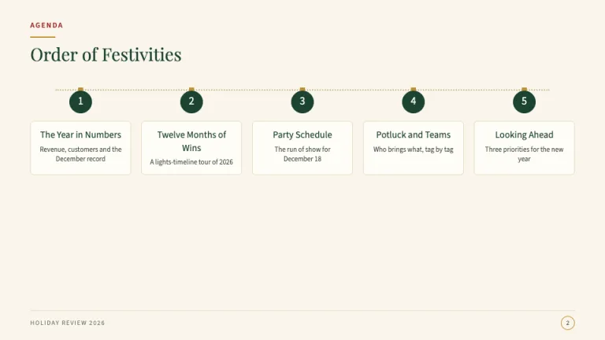
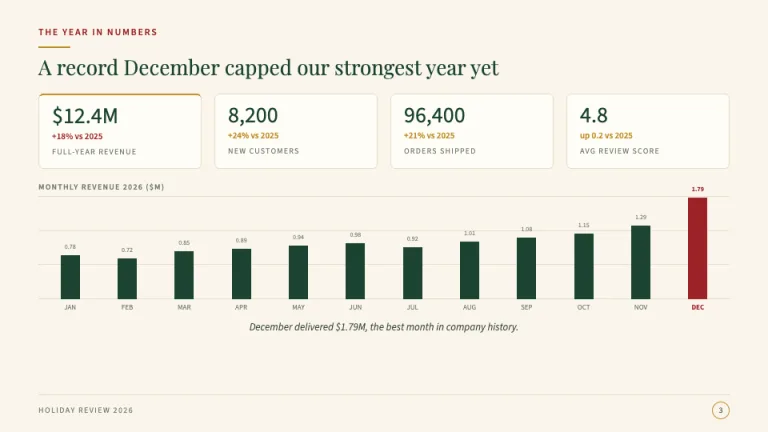
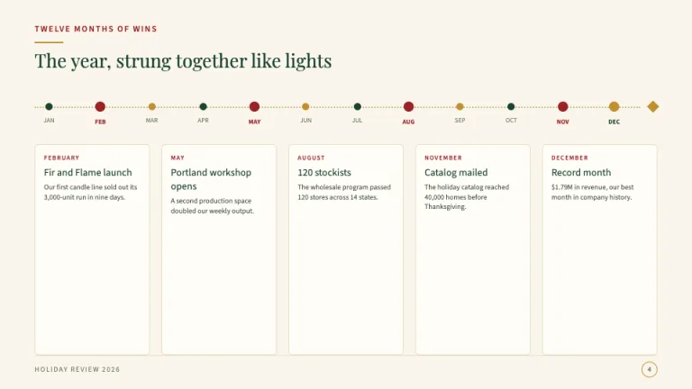
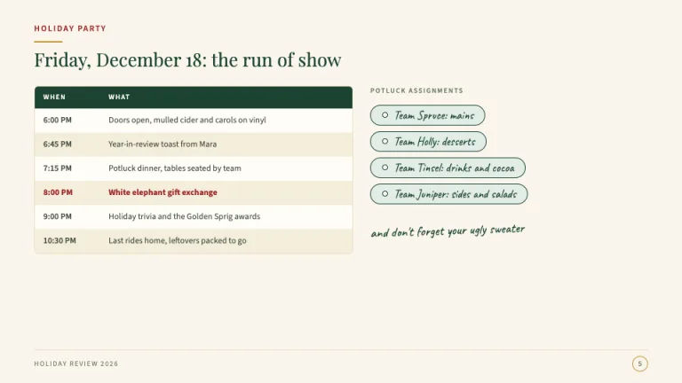
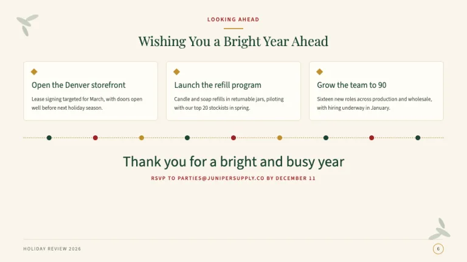

[← All prompts](../README.md) · [Live site](https://slidespeak.co/slide-design-prompts) · [SlideSpeak](https://slidespeak.co)

# Christmas

> Festive polish, zero clipart kitsch

A Christmas PowerPoint template with letterpress restraint: cream paper, deep pine and berry red, thin gold string-light rules and Playfair Display headlines. It works just as well as a Christmas Google Slides theme for year-end reviews and holiday party decks.

**Category:** Events & seasonal &nbsp;·&nbsp; **Style:** Warm, Playful &nbsp;·&nbsp; **Mode:** Light &nbsp;·&nbsp; **Fonts:** Playfair Display + Source Sans 3 + Caveat

<table>
    <tr>
      <td align="center" width="33%"><br><sub>Title</sub></td>
      <td align="center" width="33%"><br><sub>Agenda</sub></td>
      <td align="center" width="33%"><br><sub>KPI dashboard</sub></td>
    </tr>
    <tr>
      <td align="center" width="33%"><br><sub>Lights timeline</sub></td>
      <td align="center" width="33%"><br><sub>Party plan</sub></td>
      <td align="center" width="33%"><br><sub>Closing</sub></td>
    </tr>
</table>

## The prompt

Copy the prompt below into **ChatGPT**, **Claude**, or any AI chat — or grab the raw [`PROMPT.md`](./PROMPT.md). It asks what your presentation is about first, then applies the design to every slide.

```text
Create a presentation in the 'Christmas' theme, a festive year-end style built like a letterpress holiday card. Background: cream paper (#faf6ec); content sits on #fffdf6 cards bordered 1px #e6dcc4; hero cards add an inset 1px gold keyline (#c0902e) 8px inside the edge. Typography: 'Playfair Display' headlines and stat figures, 'Source Sans 3' body at 16 to 18px in #3d4a40, and 'Caveat' as a handwritten accent on chips and asides, never above 20px or twice per slide. Every header: a berry (#9b2226) small-caps kicker (12px, 0.14em tracking), a 40px by 2px gold rule, then a 40 to 48px Playfair Display headline in deep pine (#1b4332). Title slide: a centered keylined card, pine sprig ellipse clusters at 25% opacity in two corners, the kicker 'HOLIDAY EDITION' plus the current year, a 56px title, presenter and date in muted small caps. Agenda: five bauble numerals, 36px pine circles with cream numbers and tiny gold rectangle caps, hung from one 2px dotted #c9b98a string-lights line. KPI slide: four cream stat tiles with Playfair figures, the hero tile marked by a 2px gold top border, above a flat 12-bar monthly column chart in pine with the December bar in berry, 1px #e9e0cc gridlines and 11px #6f7d70 axis labels. Timeline slide: a string of lights, 10px bulbs alternating pine, berry and gold, five larger 14px bulbs for key months, each with a card below, a gold four-point star at the terminus. Party slide: a schedule table with a pine header row, cream small-caps labels and zebra rows (#fffdf6 and #f4eeda) beside gift-tag chips (#e3ede6 fill, pine border, hole-punch dot, Caveat label). Closing: three starred recommendation cards, a lights divider, then a centered Playfair thank-you with a berry small-caps RSVP line. Footer: hairline #e6dcc4, the deck name in 11px small caps, the page number in a 22px gold-outlined circle. Gold stays thin: rules, caps, stars and strokes only, at most three stars per slide. Strictly avoid: clipart Santas, reindeer, cartoon snowmen, candy canes or emoji-style icons; adjacent pure #ff0000 red and #00ff00 green; metallic gradient or glitter gold; snowfall overlays, bokeh backgrounds or pattern washes behind text; script, blackletter or novelty Santa fonts; red text on green fills or the reverse; stock photos of office parties or gift piles; drop shadows, bevels or gloss on baubles; more than one string-lights motif per slide or lights as a full-slide border; cluttered margins that stop the deck reading as a business document.

Use this theme for my slides. Ask me what the presentation is about first, then apply the theme to every slide.
```

**[Open ChatGPT ↗](https://chatgpt.com/)** &nbsp;·&nbsp; **[Open Claude ↗](https://claude.ai/new)** &nbsp;·&nbsp; **[Generate a finished deck with SlideSpeak ↗](https://app.slidespeak.co/presentation?utm_source=github&utm_medium=referral&utm_campaign=slide-design-prompts)**

## Palette

| Role | Hex |
| --- | --- |
| Background | `#faf6ec` |
| Surface / panel | `#fffdf6` |
| Border | `#e6dcc4` |
| Primary accent | `#1b4332` |
| Primary (soft tint) | `#e3ede6` |
| Text on primary | `#faf6ec` |
| Heading text | `#1f2d23` |
| Body text | `#3d4a40` |
| Muted text | `#6f7d70` |

**Chart series:** `#1b4332` `#9b2226` `#c0902e` `#a3b18a`

## Fonts

- **Playfair Display** (heading, Google Fonts)
- **Source Sans 3** (supporting, Google Fonts)
- **Caveat** (supporting, Google Fonts)

---

<sub>Part of [SlideSpeak Slide Design Prompts](../../README.md) · MIT licensed</sub>
