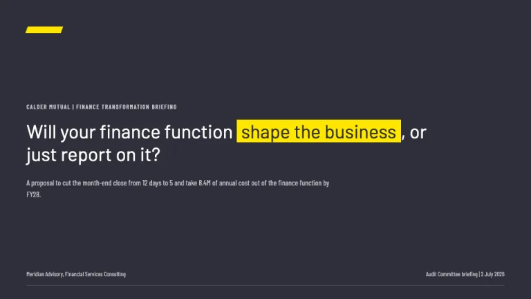
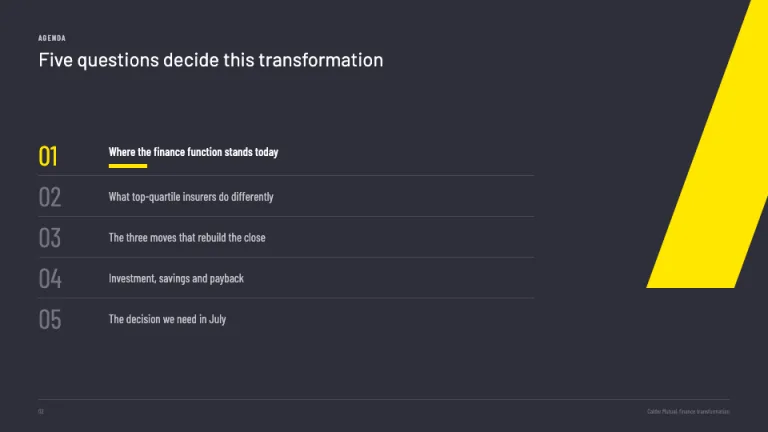
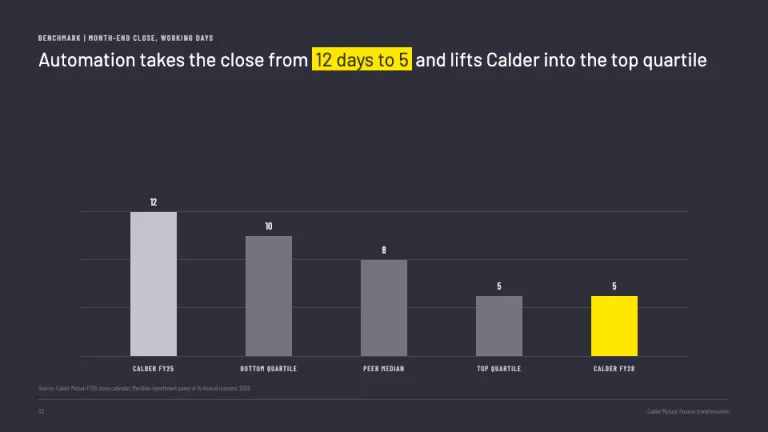
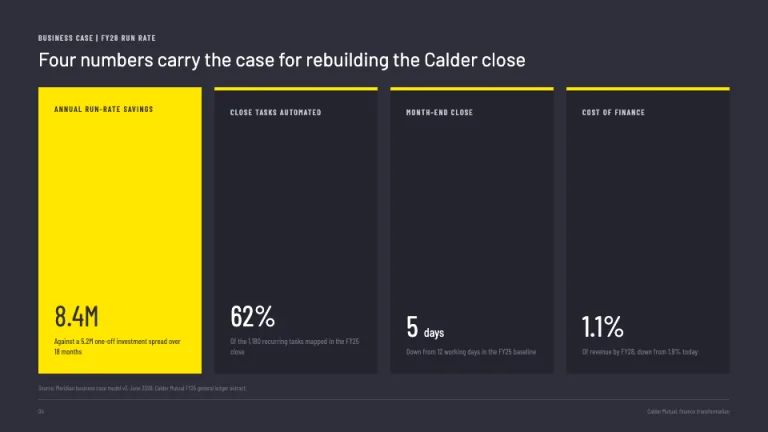
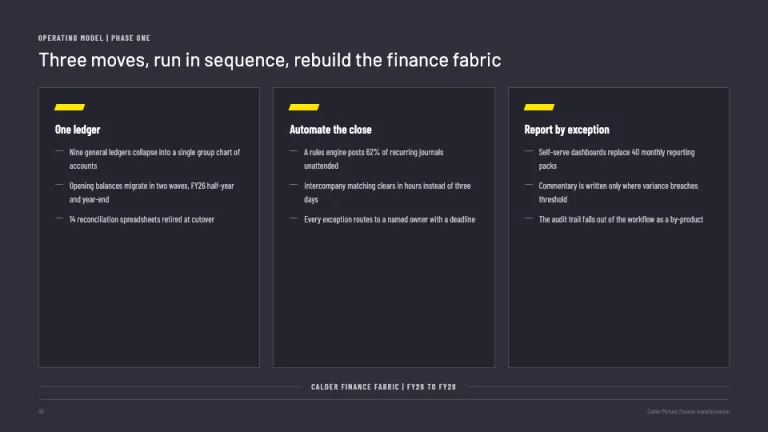
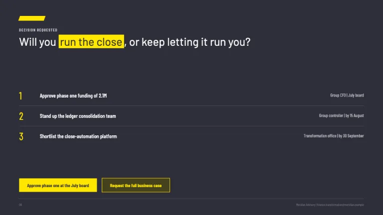

[← All prompts](../README.md) · [Live site](https://slidespeak.co/slide-design-prompts) · [SlideSpeak](https://slidespeak.co)

# EY Style

> Dark slate, one decisive yellow beam

An EY presentation template homage for PowerPoint and Google Slides: off-black #2E2E38 slides set in Barlow, with one acid yellow beam carrying every highlight, chart series and call to action. An unofficial homage to the EY presentation style. Not affiliated with, endorsed by, or approved by EY (Ernst & Young Global Limited).

**Category:** Consulting &nbsp;·&nbsp; **Style:** Corporate, Dark, Bold &nbsp;·&nbsp; **Mode:** Dark &nbsp;·&nbsp; **Fonts:** Barlow + Barlow Condensed

<table>
    <tr>
      <td align="center" width="33%"><br><sub>Title</sub></td>
      <td align="center" width="33%"><br><sub>Agenda</sub></td>
      <td align="center" width="33%"><br><sub>Highlight chart</sub></td>
    </tr>
    <tr>
      <td align="center" width="33%"><br><sub>KPI band</sub></td>
      <td align="center" width="33%"><br><sub>Framework</sub></td>
      <td align="center" width="33%"><br><sub>Closing</sub></td>
    </tr>
</table>

## The prompt

Copy the prompt below into **ChatGPT**, **Claude**, or any AI chat — or grab the raw [`PROMPT.md`](./PROMPT.md). It asks what your presentation is about first, then applies the design to every slide.

```text
Create a presentation in the 'EY Style' theme, an unofficial homage to the dark Big Four consulting deck built around a single acid yellow beam. Background: off-black slate #2E2E38 everywhere, with deeper panels and cards on #24242E, never pure #000000. Typography: 'Barlow' throughout, headlines in Barlow Light 300 at 40 to 56px in #FFFFFF, sentence case, written as full-sentence takeaways of at most two lines, the decisive phrase highlighted as #FFE600 background with #2E2E38 text; kickers and labels in 'Barlow Condensed' 600 uppercase at 12 to 13px with 0.12em letter-spacing in #C4C4CD (both Google Fonts). The signature motif is a #FFE600 parallelogram beam about 120x22px, skewed roughly 20 degrees, placed top-left above the headline or bleeding off a corner; corners stay sharp, text never rotates. Yellow is the only saturated color, one role per slide: beam, keyword highlight, underline bar, or one chart series. Title slide: beam top-left, uppercase kicker, provocative question headline, presenter and date row in #C4C4CD above a 1px #4A4A57 rule. Agenda: oversized Barlow Light numerals in #747480, white item titles, a 48x6px #FFE600 underline bar under the active item. Charts: featured series #FFE600, comparison series #747480 and #C4C4CD, flat fills, hairline #4A4A57 gridlines, 12px #F6F6FA value labels, no legends when direct labels fit; #188CE5 reserved for a fourth series. Tables: header row bottom-bordered 2px #FFE600, Barlow Condensed uppercase headers, 1px #4A4A57 row dividers, right-aligned numerals. KPI bands: square #24242E stat tiles, 4px #FFE600 top borders, Barlow Light numerals, one hero tile inverted to full #FFE600 with #2E2E38 text. Frameworks: three #24242E cards, 1px #4A4A57 borders, small beam-wedge icons, a thin labeled connecting bar beneath. Closers: a question headline with the pivotal word highlighted, numbered next-step rows with yellow numerals, and a square #FFE600 CTA chip; secondary chips are #46421C with #FFE600 text and border. Every content slide ends with a 1px #4A4A57 footer rule, then 10px #747480 text: page number left, deck title right, sources written 'Source: ...'. Strictly avoid: rounded corners, pill buttons or soft drop shadows; gold, amber or orange instead of the pure cold #FFE600; a second saturated color or rainbow multi-hue charts; gradients, glassmorphism or textured backgrounds; pure #000000 backgrounds; yellow body paragraphs or long yellow runs; serif or handwritten fonts; reproducing the EY logo, the beam-over-logotype lockup or the trademarked tagline; vague label titles like 'Q3 Results'; centered decorative layouts; claiming affiliation with EY (Ernst & Young Global Limited).

Use this theme for my slides. Ask me what the presentation is about first, then apply the theme to every slide.
```

**[Open ChatGPT ↗](https://chatgpt.com/)** &nbsp;·&nbsp; **[Open Claude ↗](https://claude.ai/new)** &nbsp;·&nbsp; **[Generate a finished deck with SlideSpeak ↗](https://app.slidespeak.co/presentation?utm_source=github&utm_medium=referral&utm_campaign=slide-design-prompts)**

## Palette

| Role | Hex |
| --- | --- |
| Background | `#2E2E38` |
| Surface / panel | `#24242E` |
| Border | `#4A4A57` |
| Primary accent | `#FFE600` |
| Primary (soft tint) | `#46421C` |
| Text on primary | `#2E2E38` |
| Heading text | `#FFFFFF` |
| Body text | `#F6F6FA` |
| Muted text | `#C4C4CD` |

**Chart series:** `#FFE600` `#C4C4CD` `#747480` `#188CE5`

## Fonts

- **Barlow** (heading, Google Fonts)
- **Barlow Condensed** (supporting, Google Fonts)

---

<sub>Part of [SlideSpeak Slide Design Prompts](../../README.md) · MIT licensed</sub>
