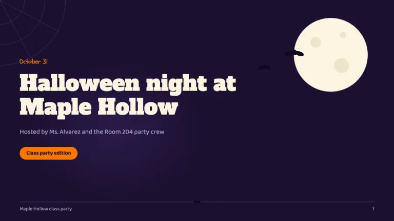
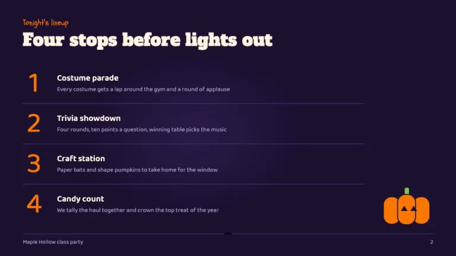
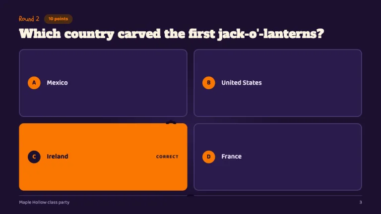
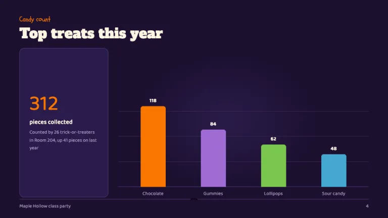
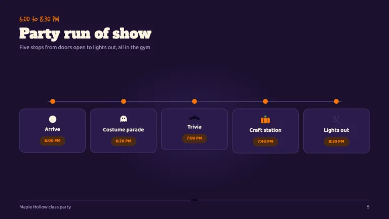
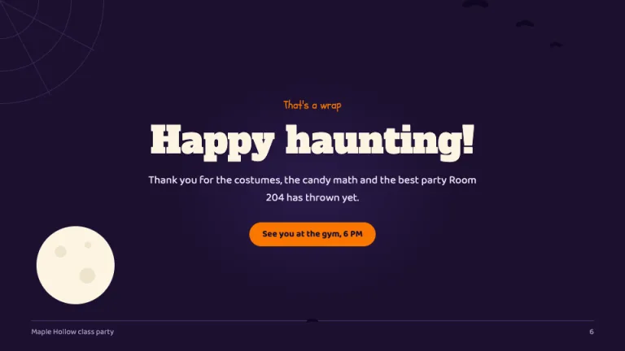

[← All prompts](../README.md) · [Live site](https://slidespeak.co/slide-design-prompts) · [SlideSpeak](https://slidespeak.co)

# Halloween

> Spooky season, classroom approved

A Halloween PowerPoint template built from flat shapes: faceless bats, a bone-white moon and shape-built pumpkins on deep midnight purple, with a quiz answer grid made for class parties and trivia rounds. Classroom safe, no gore, no clip art.

**Category:** Events & seasonal &nbsp;·&nbsp; **Style:** Playful, Dark &nbsp;·&nbsp; **Mode:** Dark &nbsp;·&nbsp; **Fonts:** Alfa Slab One + Baloo 2 + Schoolbell

<table>
    <tr>
      <td align="center" width="33%"><br><sub>Title</sub></td>
      <td align="center" width="33%"><br><sub>Tonight's lineup</sub></td>
      <td align="center" width="33%"><br><sub>Trivia round</sub></td>
    </tr>
    <tr>
      <td align="center" width="33%"><br><sub>Candy haul chart</sub></td>
      <td align="center" width="33%"><br><sub>Party run of show</sub></td>
      <td align="center" width="33%"><br><sub>Happy haunting</sub></td>
    </tr>
</table>

## The prompt

Copy the prompt below into **ChatGPT**, **Claude**, or any AI chat — or grab the raw [`PROMPT.md`](./PROMPT.md). It asks what your presentation is about first, then applies the design to every slide.

```text
Create a presentation in the 'Halloween' theme, a playful classroom-safe spooky deck drawn from flat geometric shapes. Background: deep midnight purple (#1c1030) on every slide, full bleed, with a soft #2a1b4a radial glow behind the focal element so the dark never reads flat black. Typography: slide titles in 'Alfa Slab One', bone white (#fdf4e3), 36 to 44px, sentence case, never letterspaced; above each title a small 'Schoolbell' kicker in pumpkin orange (#fa7602) at 16px, such as 'Round 2'; body text in 'Baloo 2', 16 to 18px, #e6dff2, line height 1.6, captions #a99bc7; all Google Fonts. Motifs are shapes, never clip art: a cobweb corner of 3 concentric quarter-circle arcs (radii about 60, 110 and 160px) plus 2 spokes, 1px #4a3b73 at 60 percent opacity, sits top-left on the title and closing slides only; bats are faceless #0e0620 silhouettes with two scalloped wings, in trios of diminishing size along an upward curve; the moon is a plain #fdf4e3 circle with #efe4cc crater dots, upper right, about 180px on the title slide, one bat overlapping its edge; pumpkins are three overlapping rounded rectangles in #fa7602 with a #7ac74f stem and #1c1030 triangle eyes; the ghost is a small faceless #fdf4e3 rounded-top rectangle ending in a three-scallop wavy bottom. The signature exhibit is the quiz slide: a 2x2 grid of #2a1b4a answer cards with 2px #4a3b73 borders, 12px radius and a 32px circular #fa7602 letter chip (A to D) with #1c1030 text; the correct answer flips to a solid #fa7602 card with #1c1030 text. Chips and point badges are #4a2a16 pills with #fa7602 text. Agenda numbering uses oversized 60 to 80px Alfa Slab One numerals in #fa7602. Charts are flat bars in the series order #fa7602, #a06cd5, #7ac74f, #45a8d0 with 6px top radii, hairline #372a54 gridlines and #fdf4e3 value labels above each bar; tables sit on #2a1b4a with #4a3b73 row rules and orange header text. Every slide closes with a 1px #4a3b73 footer rule, deck name left, page number right, 12px #a99bc7, one tiny bat centered on the rule. Strictly avoid: dripping-blood or oozing letterforms and any gore, skulls, knives or realistic horror imagery; pure #000000 backgrounds paired with saturated red accents; raster clip-art pumpkins, witches or ghosts; orange-to-purple gradient washes over the background; setting paragraphs or answer options in Schoolbell or Alfa Slab One; purple-on-purple low-contrast text such as #a06cd5 on #2a1b4a; cobwebs in all four corners or bats on every slide; more than one orange highlight zone per slide; glow, drop-shadow or flicker effects on text.

Use this theme for my slides. Ask me what the presentation is about first, then apply the theme to every slide.
```

**[Open ChatGPT ↗](https://chatgpt.com/)** &nbsp;·&nbsp; **[Open Claude ↗](https://claude.ai/new)** &nbsp;·&nbsp; **[Generate a finished deck with SlideSpeak ↗](https://app.slidespeak.co/presentation?utm_source=github&utm_medium=referral&utm_campaign=slide-design-prompts)**

## Palette

| Role | Hex |
| --- | --- |
| Background | `#1c1030` |
| Surface / panel | `#2a1b4a` |
| Border | `#4a3b73` |
| Primary accent | `#fa7602` |
| Primary (soft tint) | `#4a2a16` |
| Text on primary | `#1c1030` |
| Heading text | `#fdf4e3` |
| Body text | `#e6dff2` |
| Muted text | `#a99bc7` |

**Chart series:** `#fa7602` `#a06cd5` `#7ac74f` `#45a8d0`

## Fonts

- **Alfa Slab One** (heading, Google Fonts)
- **Baloo 2** (supporting, Google Fonts)
- **Schoolbell** (supporting, Google Fonts)

---

<sub>Part of [SlideSpeak Slide Design Prompts](../../README.md) · MIT licensed</sub>
