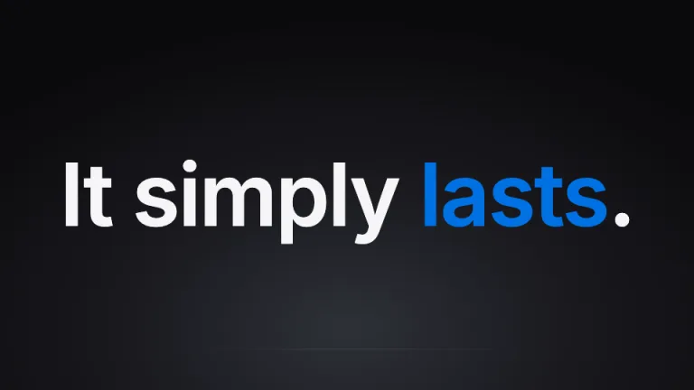
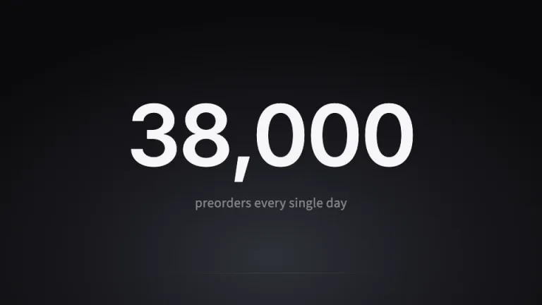
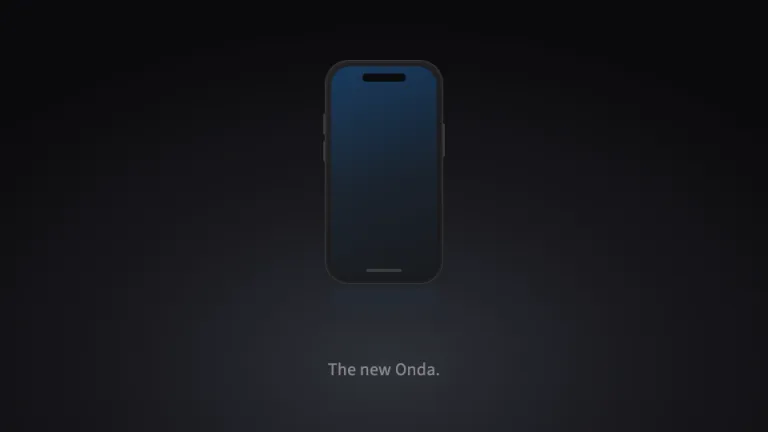
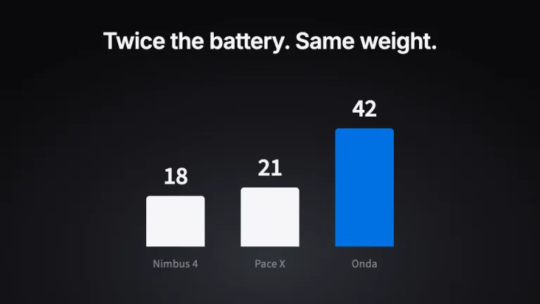
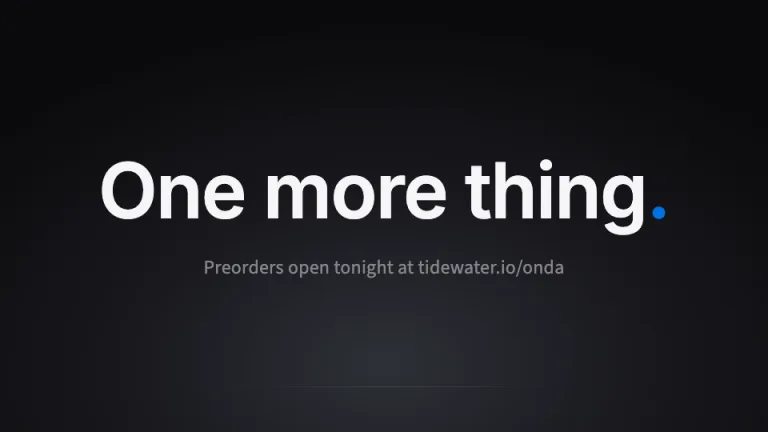

[← All prompts](../README.md) · [Live site](https://slidespeak.co/slide-design-prompts) · [SlideSpeak](https://slidespeak.co)

# Keynote Minimal

> One slide, one idea, zero clutter

An AI prompt for the Steve Jobs presentation style: one idea per slide, sentence-case statements at 100pt on a dark gradient, one giant simplified number, and a single blue accent. An original theme inspired by the minimalist keynote style popularized by Steve Jobs, not affiliated with, endorsed by, or sponsored by Apple Inc.

**Category:** Pitch decks &nbsp;·&nbsp; **Style:** Minimal, Dark, Bold &nbsp;·&nbsp; **Mode:** Dark &nbsp;·&nbsp; **Fonts:** Inter + Source Sans 3

<table>
    <tr>
      <td align="center" width="33%"><br><sub>Title</sub></td>
      <td align="center" width="33%"><br><sub>Three-word statement</sub></td>
      <td align="center" width="33%"><br><sub>Big number</sub></td>
    </tr>
    <tr>
      <td align="center" width="33%"><br><sub>Product hero</sub></td>
      <td align="center" width="33%"><br><sub>Bar comparison</sub></td>
      <td align="center" width="33%"><br><sub>One more thing</sub></td>
    </tr>
</table>

## The prompt

Copy the prompt below into **ChatGPT**, **Claude**, or any AI chat — or grab the raw [`PROMPT.md`](./PROMPT.md). It asks what your presentation is about first, then applies the design to every slide.

```text
Create a presentation in the 'Keynote Minimal' theme, an original homage to the minimalist keynote style popularized by Steve Jobs. Background: every slide carries the signature gradient, a soft radial glow of #2e3138 centered at the lower middle fading to near-black #0a0a0c at the corners; never flat black, never light. Typography: 'Inter' at weight 600 for every headline, 72 to 140pt, in off-white #f5f5f7 with -0.02em letter-spacing, always sentence case with a terminal period; captions use 'Source Sans 3' at 20 to 28pt in #d2d2d7 or muted #86868b, never more than two lines (both Google Fonts). Anatomy: one idea per slide with a hard budget of seven words, everything centered both ways, at least 60 percent of every slide left as empty gradient; no header bars, no footers, no page numbers, no dates, no logos anywhere. The only accent is #0071e3, used at most once per slide: one tinted word, one hero bar, or one thin underline. Title slide: the product or talk name at around 110pt over a single 24pt #86868b subtitle. Signature statement slide: a three-word sentence such as 'It just works.' at 100 to 130pt alone on the gradient. Big-number slide: one simplified stat up to 220pt ('34,000 a day', not '2,000,000 in 59 days') over a one-line caption at 24pt #86868b. Product hero: a centered CSS-built device silhouette in #1d1d1f with a #3a3a3c edge and a faint #0071e3 screen glow, a mirrored reflection fading from 0.25 opacity to nothing, and one short #86868b label. Charts: at most one per slide, two to four flat vertical bars, #f5f5f7 with the hero bar in #0071e3, 44pt values above each bar, category names below in #86868b. If three items must share a slide, set them as three centered lines or #10314e pills with #f5f5f7 text and 999px corners; structure runs in threes, and the deck closes with 'One more thing.' Strictly avoid: bullet points or numbered lists; header bars, footers, page numbers, dates or logos; more than seven to ten words on a slide; multi-color chart palettes or any accent beyond #0071e3; gridlines, axes, legends or 3D charts; light backgrounds or flat #000000 with no glow; images on white rectangles pasted onto the dark gradient; all-caps or title-case headlines; drop shadows, bevels or gloss beyond the subtle reflection; Apple logos, Apple product photos, the word 'Apple' as the deck's brand, or any claim of affiliation with Apple Inc.

Use this theme for my slides. Ask me what the presentation is about first, then apply the theme to every slide.
```

**[Open ChatGPT ↗](https://chatgpt.com/)** &nbsp;·&nbsp; **[Open Claude ↗](https://claude.ai/new)** &nbsp;·&nbsp; **[Generate a finished deck with SlideSpeak ↗](https://app.slidespeak.co/presentation?utm_source=github&utm_medium=referral&utm_campaign=slide-design-prompts)**

## Palette

| Role | Hex |
| --- | --- |
| Background | `#0a0a0c` |
| Surface / panel | `#1d1d1f` |
| Border | `#3a3a3c` |
| Primary accent | `#0071e3` |
| Primary (soft tint) | `#10314e` |
| Text on primary | `#ffffff` |
| Heading text | `#f5f5f7` |
| Body text | `#d2d2d7` |
| Muted text | `#86868b` |

**Chart series:** `#f5f5f7` `#0071e3` `#86868b` `#48484c`

## Fonts

- **Inter** (heading, Google Fonts)
- **Source Sans 3** (supporting, Google Fonts)

---

<sub>Part of [SlideSpeak Slide Design Prompts](../../README.md) · MIT licensed</sub>
