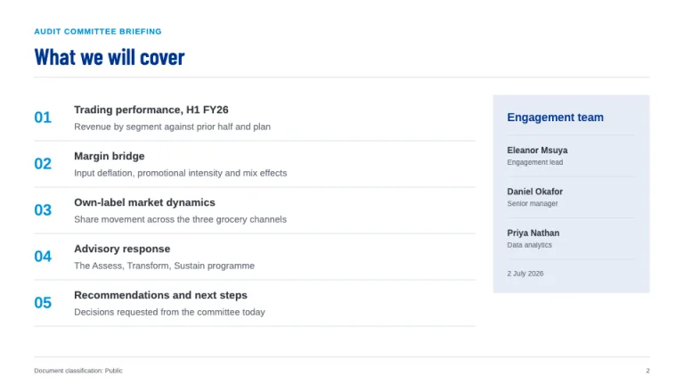
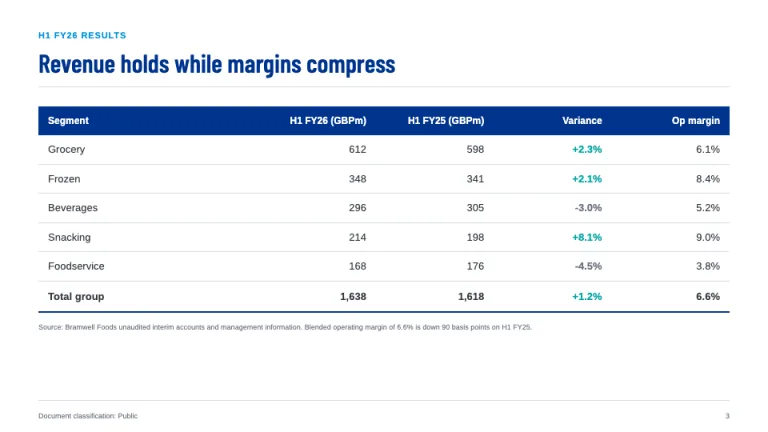
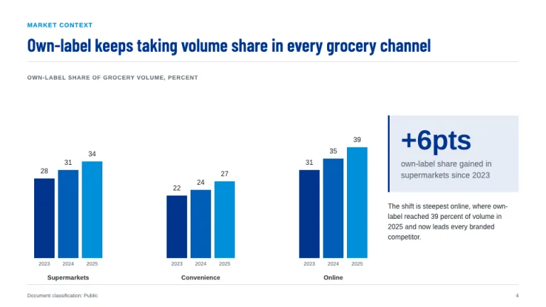
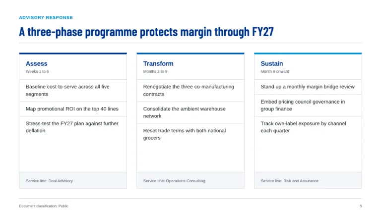
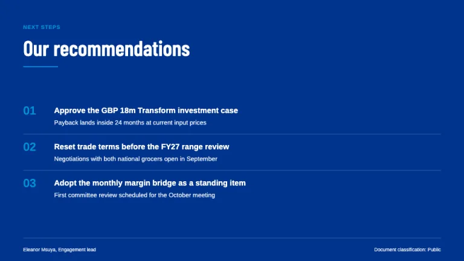

[← All prompts](../README.md) · [Live site](https://slidespeak.co/slide-design-prompts) · [SlideSpeak](https://slidespeak.co)

# KPMG Style

> Audit-grade clarity in KPMG blue

A KPMG presentation template homage in the firm's corporate blue: Barlow Condensed headlines over hairline rules, understated tables with no zebra striping, and a strict four-step chart ladder from #00338d to teal. An unofficial homage to the KPMG presentation style. Not affiliated with, endorsed by, or connected to KPMG International Limited or any KPMG member firm.

**Category:** Consulting &nbsp;·&nbsp; **Style:** Corporate, Minimal &nbsp;·&nbsp; **Mode:** Light &nbsp;·&nbsp; **Fonts:** Barlow Condensed + Arimo

<table>
    <tr>
      <td align="center" width="33%"><br><sub>Title</sub></td>
      <td align="center" width="33%"><br><sub>Agenda</sub></td>
      <td align="center" width="33%"><br><sub>Audit summary table</sub></td>
    </tr>
    <tr>
      <td align="center" width="33%"><br><sub>Market chart</sub></td>
      <td align="center" width="33%"><br><sub>Advisory framework</sub></td>
      <td align="center" width="33%"><br><sub>Recommendations</sub></td>
    </tr>
</table>

## The prompt

Copy the prompt below into **ChatGPT**, **Claude**, or any AI chat — or grab the raw [`PROMPT.md`](./PROMPT.md). It asks what your presentation is about first, then applies the design to every slide.

```text
Create a presentation in the 'KPMG Style' theme, an unofficial homage to the audit and advisory deck tradition. Background: white (#ffffff). Typography: headlines in 'Barlow Condensed' SemiBold, everything else in 'Arimo' (both Google Fonts); body copy 14 to 15px #333940, never blue; captions and sources 10 to 11px #697280. The signature header: an uppercase Arimo 11px kicker, 0.08em letter-spacing, light blue (#0091da), then a declarative headline in Barlow Condensed 30 to 34px, sentence case, KPMG blue (#00338d), top-left, closed by a full-width 1px #d8dfe9 hairline plus 32px clear space. Geometry is hard-edged: zero border-radius, no drop shadows; separation is 1px #d8dfe9 hairlines and flat #f4f6fa panels inside 48px slide padding. The blue ladder is strict: #00338d first, #005eb8 second, #0091da third, teal #00a3a1 only as a fourth series or lone positive accent. Title slide: a 6px #00338d top bar, kicker, a 54px two-line title, a 16px #697280 subtitle, and a bottom hairline row with date, classification and a square #00338d monogram block. Agenda items number 01, 02, 03 in Barlow Condensed 22px #0091da between hairline rows, descriptions 13px #697280. The signature exhibit is the understated table: white rows split by hairline horizontals only, a #00338d header row in white 12px Arimo Bold, right-aligned numerals, a bold totals row closed by a 2px #00338d rule; favourable variances in #00a3a1, unfavourable in #697280, never red. Charts carry one message each: solid bars in #00338d, #005eb8 and #0091da, no gridlines, direct Arimo 12px value labels at bar ends, axis labels #697280. Framework slides use equal flat white rectangles with 1px #d8dfe9 borders and 4px top edges stepping down the ladder; key stats sit on #e6ecf6 chips with a 3px #00338d left edge in Barlow Condensed 40 to 56px. Every content slide footer: a 1px #d8dfe9 rule 40px from the bottom, 'Document classification: Public' left, page number right, 9px #697280. Section dividers and the closing slide flood the canvas with solid #00338d, oversized white Barlow Condensed type above a thin #0091da rule. Strictly avoid: rounded corners, pill buttons or drop shadows; warm or rainbow chart palettes; zebra-striped or vertically ruled tables; gradients, glassmorphism or background photos; blue body copy or all-caps paragraphs; the actual KPMG logo, four-square mark or 'Cutting through complexity' tagline; charts with legends, gridlines or 3D effects; centered layouts and script or serif display fonts; red as a negative-variance color; claiming affiliation with KPMG International Limited or any KPMG member firm.

Use this theme for my slides. Ask me what the presentation is about first, then apply the theme to every slide.
```

**[Open ChatGPT ↗](https://chatgpt.com/)** &nbsp;·&nbsp; **[Open Claude ↗](https://claude.ai/new)** &nbsp;·&nbsp; **[Generate a finished deck with SlideSpeak ↗](https://app.slidespeak.co/presentation?utm_source=github&utm_medium=referral&utm_campaign=slide-design-prompts)**

## Palette

| Role | Hex |
| --- | --- |
| Background | `#ffffff` |
| Surface / panel | `#f4f6fa` |
| Border | `#d8dfe9` |
| Primary accent | `#00338d` |
| Primary (soft tint) | `#e6ecf6` |
| Text on primary | `#ffffff` |
| Heading text | `#00338d` |
| Body text | `#333940` |
| Muted text | `#697280` |

**Chart series:** `#00338d` `#005eb8` `#0091da` `#00a3a1`

## Fonts

- **Barlow Condensed** (heading, Google Fonts)
- **Arimo** (supporting, Google Fonts)

---

<sub>Part of [SlideSpeak Slide Design Prompts](../../README.md) · MIT licensed</sub>
