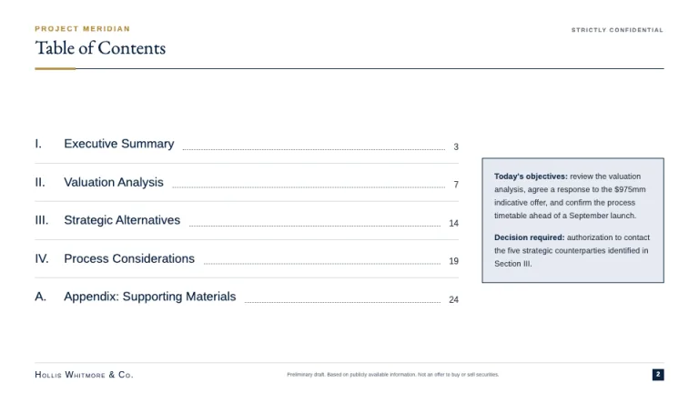
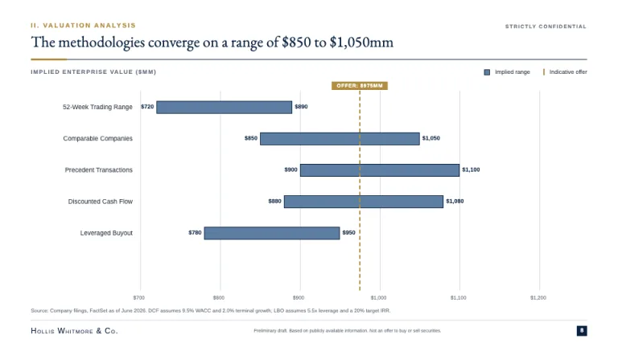
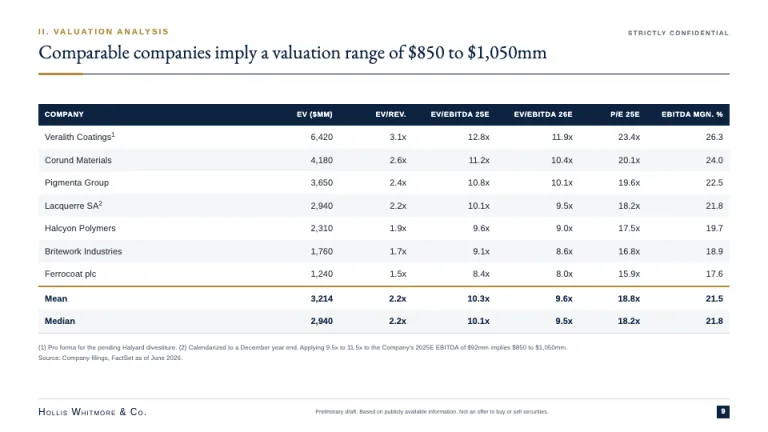
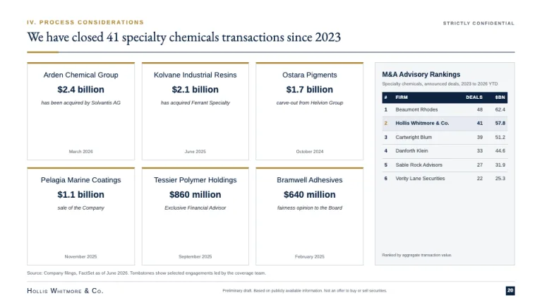
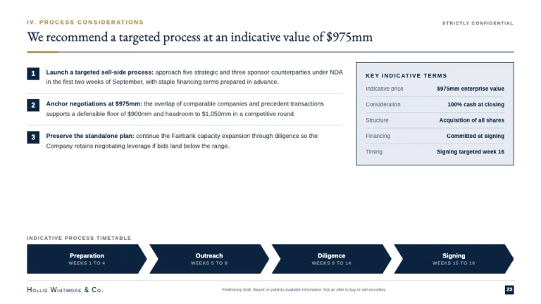

[← All prompts](../README.md) · [Live site](https://slidespeak.co/slide-design-prompts) · [SlideSpeak](https://slidespeak.co)

# Pitch Book

> Navy rigor, gold rules, dense conviction

A classic investment banking pitch deck in navy and gold: football-field valuation charts, dense comps tables, tombstone credentials and a confidentiality mark on every page. Generic banking conventions with no specific firm referenced.

**Category:** Finance &nbsp;·&nbsp; **Style:** Corporate, Elegant &nbsp;·&nbsp; **Mode:** Light &nbsp;·&nbsp; **Fonts:** EB Garamond + Arimo

<table>
    <tr>
      <td align="center" width="33%"><br><sub>Title</sub></td>
      <td align="center" width="33%"><br><sub>Agenda</sub></td>
      <td align="center" width="33%"><br><sub>Football field</sub></td>
    </tr>
    <tr>
      <td align="center" width="33%"><br><sub>Comps table</sub></td>
      <td align="center" width="33%"><br><sub>Credentials</sub></td>
      <td align="center" width="33%"><br><sub>Recommendation</sub></td>
    </tr>
</table>

## The prompt

Copy the prompt below into **ChatGPT**, **Claude**, or any AI chat — or grab the raw [`PROMPT.md`](./PROMPT.md). It asks what your presentation is about first, then applies the design to every slide.

```text
Create a presentation in the 'Pitch Book' theme, a dense investment-banking sell-side deck in navy and gold. Background: white (#ffffff). Typography: 'EB Garamond' for titles, wordmarks and tombstone client names, 'Arimo' for body, tables and labels. Each content slide opens with a 10px uppercase letterspaced Arimo kicker in gold (#b08d3f), then a full-sentence action title in EB Garamond 26 to 30px navy (#0c2340) over a full-width 1px navy rule with a 56px 3px gold segment flush left; STRICTLY CONFIDENTIAL sits top-right in 8px uppercase gray (#66707d). Body: 11 to 13px Arimo (#2b3542), 4 to 5% side margins, multi-column exhibits, every region filled. Cover: full-bleed navy (#0c2340), centered EB Garamond small-caps wordmark, thin gold rules framing the engagement title, date and STRICTLY CONFIDENTIAL in 9px uppercase (#a8b2bd) along the bottom. Agenda: Roman numerals in EB Garamond with dot leaders to right-aligned page numbers. Signature exhibit: a football-field valuation chart of horizontal floating bars, one row per methodology (52-Week Trading Range, Comparable Companies, Precedent Transactions, DCF, LBO), filled #5c7ea3 with 1px navy borders, dollar labels at bar ends and a dashed 2px gold offer-price line crossing all rows under a gold chip. Comps tables: navy header with white 10px uppercase labels, zebra #ffffff and #f4f6f8 rows, right-aligned tabular figures, negatives in parentheses, units in the column head, bold Mean and Median rows above a 2px gold top border. Credentials: white tombstone cards with a 3px gold top rule in a tight 3x2 grid (client name, deal value, italic role line, date) beside a league table with the pitching firm's row highlighted #e6ebf2 and a bold gold rank numeral. Recommendation: numbered points with bold navy lead-ins, a #e6ebf2 key-terms callout with 1px navy border, and a navy chevron timeline. Every exhibit carries an 8px source footnote; every content slide a footer: 1px #d3d9e0 top border, small-caps wordmark, 7px disclaimer, page number in a small navy square. Charts are flat: 0px radius, 1px #d3d9e0 gridlines, 9px axis labels, no gradients or shadows. Strictly avoid: rounded corners, pill buttons or soft card shadows; bright startup colors or saturated gradients; gold as a dominant background or large fill; sparse minimalist slides with oversized display type; icons, emoji, illustrations or stock photography; left-aligned or comma-free numerics in tables; one-word slide titles like 'Valuation'; omitting source footnotes, confidentiality marks or page numbers; casual geometric fonts like Poppins or Baloo in place of the serif-plus-grotesque banking pairing.

Use this theme for my slides. Ask me what the presentation is about first, then apply the theme to every slide.
```

**[Open ChatGPT ↗](https://chatgpt.com/)** &nbsp;·&nbsp; **[Open Claude ↗](https://claude.ai/new)** &nbsp;·&nbsp; **[Generate a finished deck with SlideSpeak ↗](https://app.slidespeak.co/presentation?utm_source=github&utm_medium=referral&utm_campaign=slide-design-prompts)**

## Palette

| Role | Hex |
| --- | --- |
| Background | `#ffffff` |
| Surface / panel | `#f4f6f8` |
| Border | `#d3d9e0` |
| Primary accent | `#0c2340` |
| Primary (soft tint) | `#e6ebf2` |
| Text on primary | `#ffffff` |
| Heading text | `#0c2340` |
| Body text | `#2b3542` |
| Muted text | `#66707d` |

**Chart series:** `#0c2340` `#b08d3f` `#5c7ea3` `#a8b2bd`

## Fonts

- **EB Garamond** (heading, Google Fonts)
- **Arimo** (supporting, Google Fonts)

---

<sub>Part of [SlideSpeak Slide Design Prompts](../../README.md) · MIT licensed</sub>
