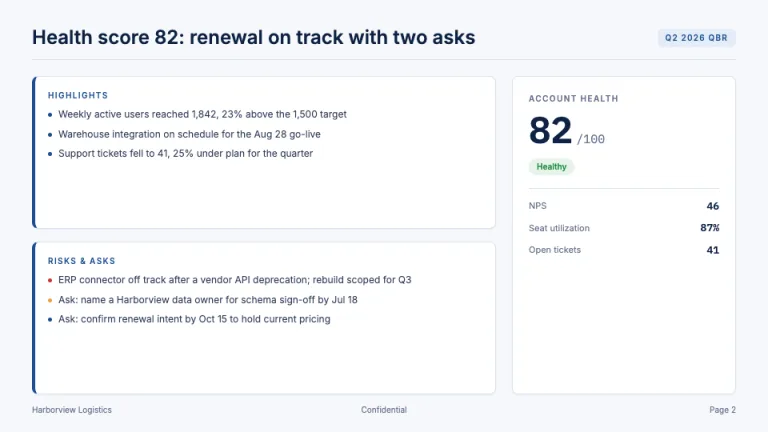
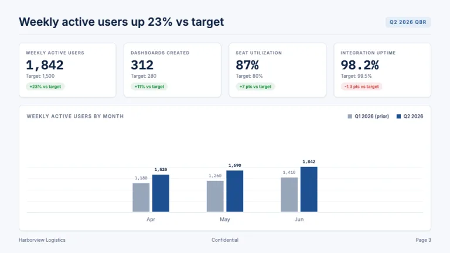
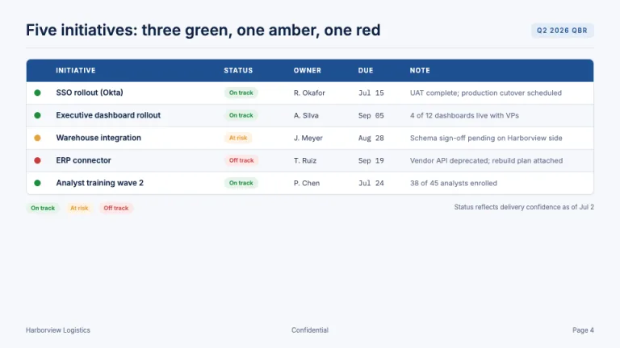
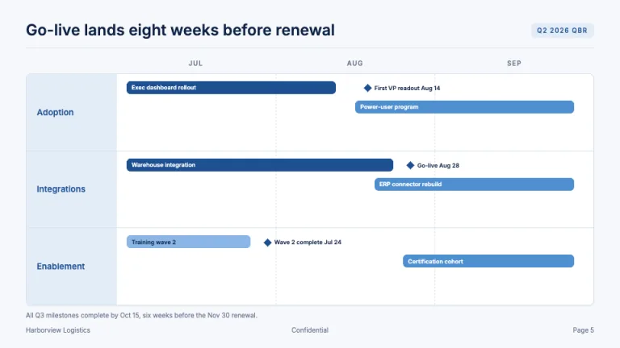
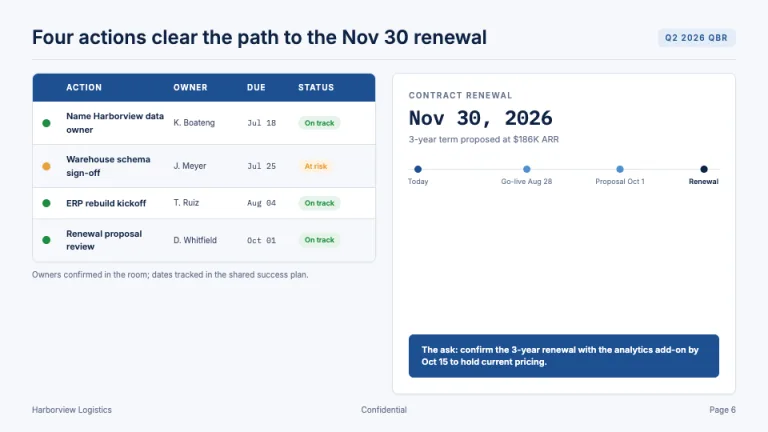

[← All prompts](../README.md) · [Live site](https://slidespeak.co/slide-design-prompts) · [SlideSpeak](https://slidespeak.co)

# QBR

> Targets, actuals, and the renewal story

A quarterly business review template with the scorecard discipline executives expect: KPI tiles with targets and variance chips, a strict RAG status table, blue-ramp charts, and a 90-day swimlane roadmap that ends in the renewal ask. Prompt any AI presentation maker into a credible QBR deck.

**Category:** Business & strategy &nbsp;·&nbsp; **Style:** Corporate, Minimal &nbsp;·&nbsp; **Mode:** Light &nbsp;·&nbsp; **Fonts:** Inter + IBM Plex Mono

<table>
    <tr>
      <td align="center" width="33%"><br><sub>Title</sub></td>
      <td align="center" width="33%"><br><sub>Executive summary</sub></td>
      <td align="center" width="33%"><br><sub>KPI scorecard</sub></td>
    </tr>
    <tr>
      <td align="center" width="33%"><br><sub>RAG status table</sub></td>
      <td align="center" width="33%"><br><sub>90-day roadmap</sub></td>
      <td align="center" width="33%"><br><sub>Renewal & next steps</sub></td>
    </tr>
</table>

## The prompt

Copy the prompt below into **ChatGPT**, **Claude**, or any AI chat — or grab the raw [`PROMPT.md`](./PROMPT.md). It asks what your presentation is about first, then applies the design to every slide.

```text
Create a presentation in the 'QBR' theme, a customer-success quarterly business review deck built on scorecard discipline. Background: cool off-white (#f6f8fb) with white cards, 40px padding, 16-20px gaps, 8px radius, shadows max 0 1px 2px rgba(15,35,68,.06). Typography: 'Inter' for headings and prose, 'IBM Plex Mono' for every numeral in tiles, tables and axis labels so figures align (both Google Fonts). Every content slide shares one header: a one-line takeaway title in Inter 600 at ~28px in #0f2344 ('Adoption up 23%, two integrations at risk', never 'Usage update'), a soft-blue #e4edf8 chip top-right with the quarter tag in #1d4f91 11px caps, and a 1px #d9e1ec rule; footer: a 10px #66748c line, account name left, 'Confidential' center, page number right. The signature exhibit is the KPI tile row: four white cards (1px #d9e1ec border, 8px radius), stacking an 11px caps #66748c label, a ~34px IBM Plex Mono actual in #0f2344, a 'Target: X' subline, and a variance chip (#1e8e3e on #e6f4ea, or #c93b3b on #fbeaea). RAG status is strict semantics: green #1e8e3e, amber #e8a13d, red #c93b3b as 10px dots or pills ('On track'/'At risk'/'Off track') on tints #e6f4ea/#fdf3e3/#fbeaea, never as chart colors. Charts use only the blue ramp #1d4f91, #4f8fd0, #8ab6e6 with #98a6ba for prior-period series: flat fills, 1px #e7edf5 gridlines, 11px #66748c axis labels. Tables get a #1d4f91 header row in white 12px caps, zebra rows in #f6f8fb, a leftmost RAG-dot column, and Owner and Due on every action row. Title slide is the one dark moment: full-bleed #1d4f91, white Inter 700 'Quarterly Business Review', an account-and-vendor lockup, quarter, date and presenter in #8ab6e6. Executive summary: a 3-zone one-pager, highlights and risks-and-asks cards with 4px #1d4f91 left borders, plus a health scorecard with a ~48px IBM Plex Mono score and a RAG pill. Roadmaps are swimlanes: 140px #e4edf8 lane labels, dashed #d9e1ec month dividers, rounded 6px bars in the blue ramp, navy milestone diamonds; the closer pairs an action table with a renewal card and a navy ask strip. Strictly avoid: red, amber or green as chart series colors; over 6 KPI tiles per slide or tiles without a target and variance line; rainbow or gradient charts, 3D bars, pie charts for trends; topic-only titles; status pills without owner and due date on the row; stock photos, clipart or icon soup; dark backgrounds on content slides; proportional-figure fonts for numbers; heavy borders, drop shadows or corners rounded above 8px.

Use this theme for my slides. Ask me what the presentation is about first, then apply the theme to every slide.
```

**[Open ChatGPT ↗](https://chatgpt.com/)** &nbsp;·&nbsp; **[Open Claude ↗](https://claude.ai/new)** &nbsp;·&nbsp; **[Generate a finished deck with SlideSpeak ↗](https://app.slidespeak.co/presentation?utm_source=github&utm_medium=referral&utm_campaign=slide-design-prompts)**

## Palette

| Role | Hex |
| --- | --- |
| Background | `#f6f8fb` |
| Surface / panel | `#ffffff` |
| Border | `#d9e1ec` |
| Primary accent | `#1d4f91` |
| Primary (soft tint) | `#e4edf8` |
| Text on primary | `#ffffff` |
| Heading text | `#0f2344` |
| Body text | `#33415c` |
| Muted text | `#66748c` |

**Chart series:** `#1d4f91` `#4f8fd0` `#8ab6e6` `#98a6ba`

## Fonts

- **Inter** (heading, Google Fonts)
- **IBM Plex Mono** (supporting, Google Fonts)

---

<sub>Part of [SlideSpeak Slide Design Prompts](../../README.md) · MIT licensed</sub>
