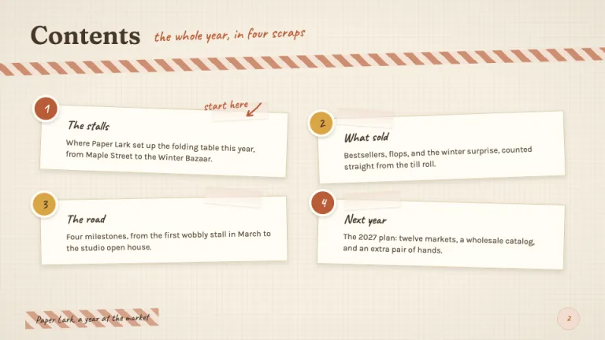
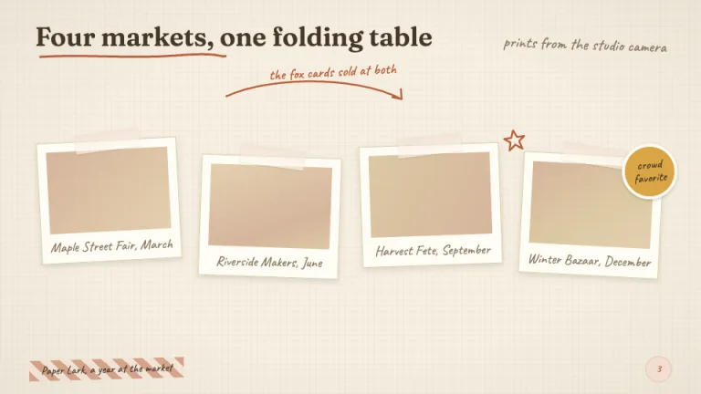
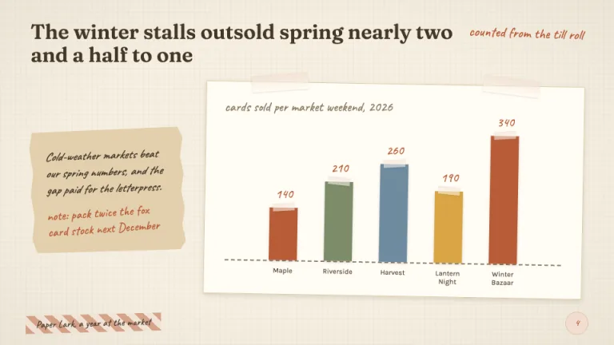
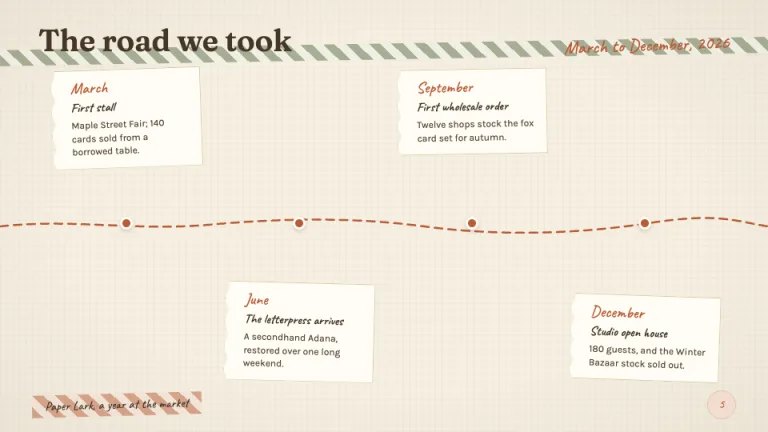
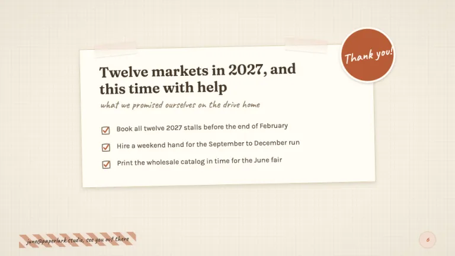

[← All prompts](../README.md) · [Live site](https://slidespeak.co/slide-design-prompts) · [SlideSpeak](https://slidespeak.co)

# Scrapbook

> Paper, tape, and handwritten charm

A scrapbook PowerPoint template look built entirely in CSS: cream paper grain, taped polaroid frames, washi strips, torn kraft edges and handwritten Caveat captions. Use the prompt to generate scrapbook slides that feel hand-assembled, from the title page to the thank-you sticker.

**Category:** Creative & portfolio &nbsp;·&nbsp; **Style:** Playful, Warm &nbsp;·&nbsp; **Mode:** Light &nbsp;·&nbsp; **Fonts:** Fraunces + Caveat + Karla

<table>
    <tr>
      <td align="center" width="33%"><br><sub>Title</sub></td>
      <td align="center" width="33%"><br><sub>Agenda scraps</sub></td>
      <td align="center" width="33%"><br><sub>Photo board</sub></td>
    </tr>
    <tr>
      <td align="center" width="33%"><br><sub>Paper-strip chart</sub></td>
      <td align="center" width="33%"><br><sub>Journey timeline</sub></td>
      <td align="center" width="33%"><br><sub>Closing note</sub></td>
    </tr>
</table>

## The prompt

Copy the prompt below into **ChatGPT**, **Claude**, or any AI chat — or grab the raw [`PROMPT.md`](./PROMPT.md). It asks what your presentation is about first, then applies the design to every slide.

```text
Create a presentation in the 'Scrapbook' theme, a paper-and-tape collage style built entirely in CSS. Background: warm cream (#f6efe1) with a subtle paper grain, two 1px repeating-linear-gradient line layers in rgba(138,122,99,0.05) at 0 and 90 degrees plus a faint radial vignette of rgba(74,58,42,0.06) at the edges, never a flat fill. Typography: headings in 'Fraunces' 600 espresso (#443627), slide titles 40 to 48px, body in 'Karla' 15 to 17px warm brown (#574838), and every caption, data label and margin note in 'Caveat' 20 to 26px, #8a7a63 or terracotta (#b95c38), rotated 1 to 3 degrees (all Google Fonts). Every title gets a hand touch: a rotated Caveat annotation or rough #b95c38 SVG underline. Content sits on paper cards: #fffcf4 surface, 1px #d9c9a8 border, soft warm shadow 0 3px 8px rgba(68,54,39,0.16), each card rotated between -3 and 3 degrees with neighbors leaning opposite ways. The signature motif is the taped card: 88 by 26px tape rectangles in rgba(255,252,244,0.55) with a faint terracotta gradient tint, rotated about -5 degrees across each card's top edge. Washi strips, 20px repeating 45-degree stripes of #b95c38 with #f3ddd0 (or sage #7d8b6a with #eef0e6) at 65% opacity, divide headers and anchor footers; torn-edge section breaks are kraft strips (#e3d0ae) cut by an irregular clip-path polygon over a soft shadow strip. Title slide: torn kraft strip carrying the title, a taped polaroid upper right, a presenter note card lower left. Agenda: four staggered scraps with round number stickers. Photo board: four polaroid frames (12px sides, 44px caption band) with kraft-gradient placeholders, wobbly doodle arrows and one sticker callout. Charts: paper-strip bars in #b95c38, #7d8b6a, #6f8ba0 and #d9a544 with tiny tape tops, Caveat value labels and a 2px dashed #8a7a63 baseline. Timelines: a wobbly dashed stitch line with ticket-stub milestone cards, torn left edges, dates in Caveat. Tables: staggered pinned note cards, headers in Caveat on a washi strip. Footer: a washi scrap with the deck title in Caveat 16px bottom left, the page number in a #f3ddd0 round sticker bottom right. Strictly avoid: flat untextured white backgrounds, perfectly straight grid-aligned cards, all cards rotated the same direction or angle, corporate blues, neon accents or glossy 3D gradients, harsh black drop shadows (shadows stay warm brown and soft), full-bleed unframed photos, Caveat used for body paragraphs, chart gridlines, axis boxes or legend chrome, more than three doodles or five stickers on one slide, and any external texture images or CDN assets.

Use this theme for my slides. Ask me what the presentation is about first, then apply the theme to every slide.
```

**[Open ChatGPT ↗](https://chatgpt.com/)** &nbsp;·&nbsp; **[Open Claude ↗](https://claude.ai/new)** &nbsp;·&nbsp; **[Generate a finished deck with SlideSpeak ↗](https://app.slidespeak.co/presentation?utm_source=github&utm_medium=referral&utm_campaign=slide-design-prompts)**

## Palette

| Role | Hex |
| --- | --- |
| Background | `#f6efe1` |
| Surface / panel | `#fffcf4` |
| Border | `#d9c9a8` |
| Primary accent | `#b95c38` |
| Primary (soft tint) | `#f3ddd0` |
| Text on primary | `#fffcf4` |
| Heading text | `#443627` |
| Body text | `#574838` |
| Muted text | `#8a7a63` |

**Chart series:** `#b95c38` `#7d8b6a` `#6f8ba0` `#d9a544`

## Fonts

- **Fraunces** (heading, Google Fonts)
- **Caveat** (supporting, Google Fonts)
- **Karla** (supporting, Google Fonts)

---

<sub>Part of [SlideSpeak Slide Design Prompts](../../README.md) · MIT licensed</sub>
