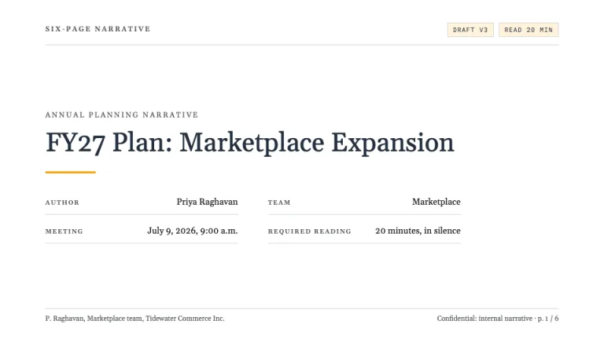
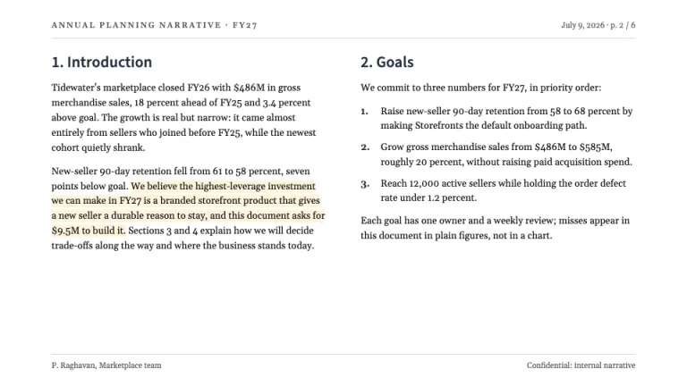
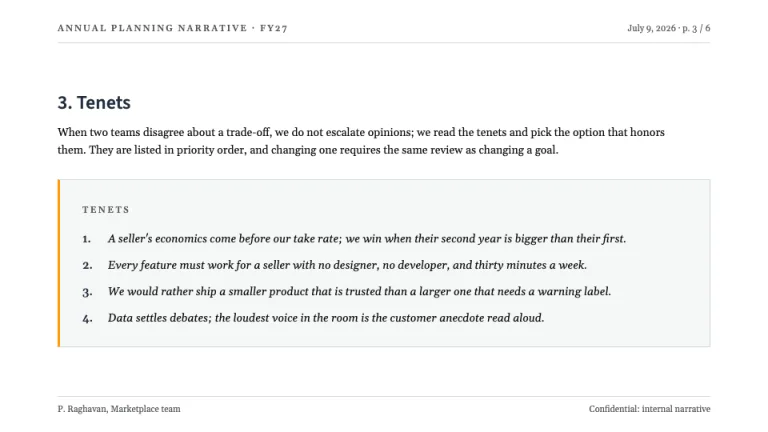
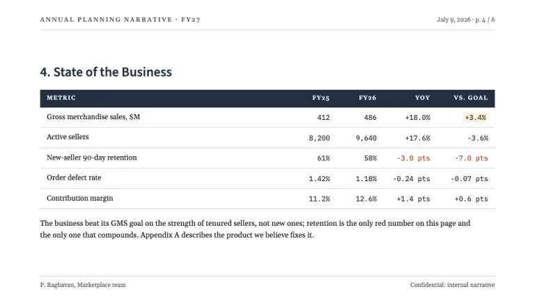
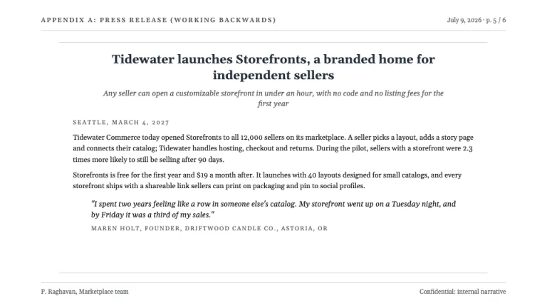
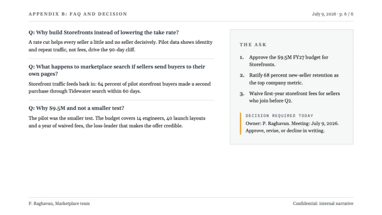

[← All prompts](../README.md) · [Live site](https://slidespeak.co/slide-design-prompts) · [SlideSpeak](https://slidespeak.co)

# Six-Pager

> The memo that runs the meeting

The Amazon 6 pager rebuilt as a deck: this narrative memo format turns slides into numbered document pages with dense Gelasio prose, no bullet points, ruled data tables, a tenets panel and a working-backwards press release, all black ink with one orange accent. An unofficial homage to the narrative memo culture popularized by Amazon; not affiliated with, sponsored by, or endorsed by Amazon.com, Inc.

**Category:** Business & strategy &nbsp;·&nbsp; **Style:** Minimal, Corporate &nbsp;·&nbsp; **Mode:** Light &nbsp;·&nbsp; **Fonts:** Source Sans 3 + Gelasio + IBM Plex Mono

<table>
    <tr>
      <td align="center" width="33%"><br><sub>Title</sub></td>
      <td align="center" width="33%"><br><sub>Narrative page</sub></td>
      <td align="center" width="33%"><br><sub>Tenets box</sub></td>
    </tr>
    <tr>
      <td align="center" width="33%"><br><sub>Ruled data table</sub></td>
      <td align="center" width="33%"><br><sub>Press release</sub></td>
      <td align="center" width="33%"><br><sub>FAQ + the ask</sub></td>
    </tr>
</table>

## The prompt

Copy the prompt below into **ChatGPT**, **Claude**, or any AI chat — or grab the raw [`PROMPT.md`](./PROMPT.md). It asks what your presentation is about first, then applies the design to every slide.

```text
Create a presentation in the 'Six-Pager' theme, an unofficial homage to the narrative memo culture popularized by Amazon. Every slide is a white (#ffffff) document page with generous 7 to 8 percent side margins, dense and text-first: a printed memo page, not a slide. Typography: 'Source Sans 3' for numbered headings, labels and document chrome, 'Gelasio' for left-aligned body prose at 15 to 17px with line-height 1.55, and 'IBM Plex Mono' for figures and status chips (all Google Fonts). The signature chrome: a memo header on every page, small-caps document slug top-left, date and page marker like 'p. 3 / 6' top-right in #565959 at 11px over a 1px #d5d9d9 hairline, plus a matching footer hairline with the doc owner left and 'Confidential: internal narrative' right. Section titles are numbered memo headings ('2. Goals', '3. Tenets') in Source Sans 3 semibold #232f3e at 22 to 28px, never oversized. No bullet points anywhere: use numbered lists or full paragraphs, two prose columns for heavy narrative, one thesis sentence highlighted #fff3dc. Cover: a document title block with a doc-type label, a Gelasio title in #232f3e over a short #ff9900 underline stroke, a ruled two-column metadata grid (author, team, meeting date, read time) and a 'DRAFT v3' IBM Plex Mono chip on #fff3dc. Tenets page: an #f6f7f7 panel with a 1px #d5d9d9 border, a 3px #ff9900 left rule, a small-caps 'TENETS' label, and numbered principles in Gelasio italic. Data appears only as plain ruled tables, never charts: a #232f3e header row with white caps, 1px #d5d9d9 rules between rows, right-aligned IBM Plex Mono figures, misses in #b12704, one key beat highlighted #fff3dc, a two-sentence Gelasio takeaway below. Include a working-backwards press-release page (centered Gelasio headline and subheadline, small-caps 'SEATTLE' dateline, indented italic customer quote with attribution) and a closing FAQ page with bold 'Q:' leads, hairline separators and a 'The Ask' panel holding a numbered decision list with one #ff9900-accented approval line. Orange is a hairline accent only. Strictly avoid: bullet points of any kind; charts, graphs or dataviz decoration; large orange fills, gradients or orange headline text; hero photography, stock images or icon grids; oversized display typography or sparse one-line zen slides; recreating the Amazon logo or smile arrow; rounded cards, drop shadows and glassmorphism; center-aligned body prose except the press-release headline; cutting page metadata like page counts, author and date; claiming affiliation with Amazon.com, Inc.

Use this theme for my slides. Ask me what the presentation is about first, then apply the theme to every slide.
```

**[Open ChatGPT ↗](https://chatgpt.com/)** &nbsp;·&nbsp; **[Open Claude ↗](https://claude.ai/new)** &nbsp;·&nbsp; **[Generate a finished deck with SlideSpeak ↗](https://app.slidespeak.co/presentation?utm_source=github&utm_medium=referral&utm_campaign=slide-design-prompts)**

## Palette

| Role | Hex |
| --- | --- |
| Background | `#ffffff` |
| Surface / panel | `#f6f7f7` |
| Border | `#d5d9d9` |
| Primary accent | `#ff9900` |
| Primary (soft tint) | `#fff3dc` |
| Text on primary | `#232f3e` |
| Heading text | `#232f3e` |
| Body text | `#0f1111` |
| Muted text | `#565959` |

**Chart series:** `#232f3e` `#ff9900` `#146eb4` `#879596`

## Fonts

- **Source Sans 3** (heading, Google Fonts)
- **Gelasio** (supporting, Google Fonts)
- **IBM Plex Mono** (supporting, Google Fonts)

---

<sub>Part of [SlideSpeak Slide Design Prompts](../../README.md) · MIT licensed</sub>
