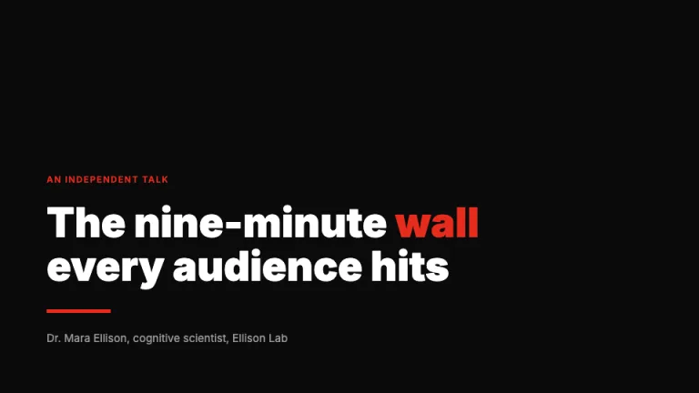
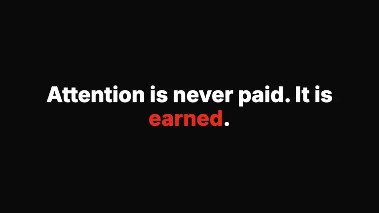
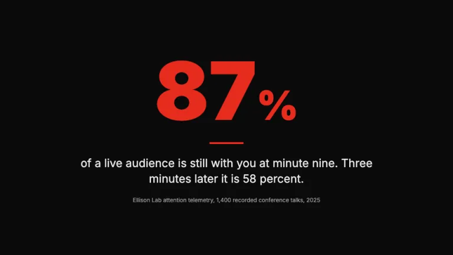
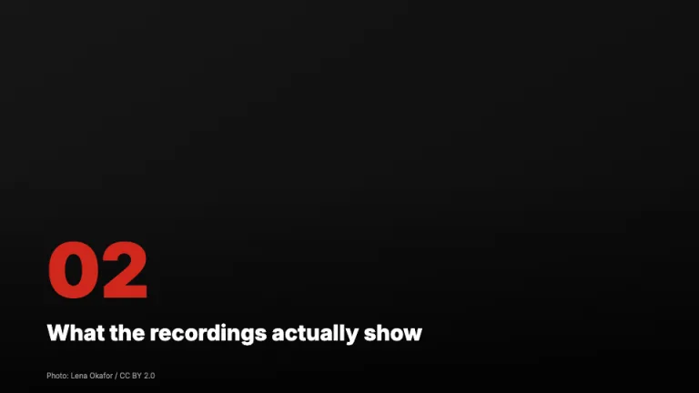
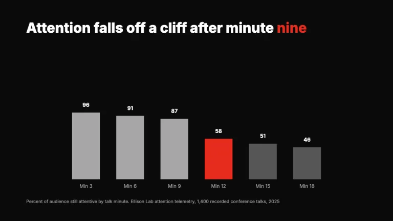
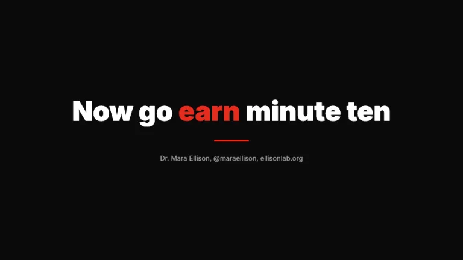

[← All prompts](../README.md) · [Live site](https://slidespeak.co/slide-design-prompts) · [SlideSpeak](https://slidespeak.co)

# TED Style

> Say it huge, keep it dark

The dark-stage talk deck: one idea per slide on a near-black canvas, huge Inter statements with a single word in red, and giant statistics in place of bullet points, built for anyone writing ted talk slides or planning a ted style presentation. An unofficial homage to the TED presentation style; not affiliated with, sponsored by, or endorsed by TED Conferences LLC.

**Category:** Education & research &nbsp;·&nbsp; **Style:** Bold, Dark &nbsp;·&nbsp; **Mode:** Dark &nbsp;·&nbsp; **Fonts:** Inter

<table>
    <tr>
      <td align="center" width="33%"><br><sub>Title</sub></td>
      <td align="center" width="33%"><br><sub>Big statement</sub></td>
      <td align="center" width="33%"><br><sub>Giant statistic</sub></td>
    </tr>
    <tr>
      <td align="center" width="33%"><br><sub>Section break</sub></td>
      <td align="center" width="33%"><br><sub>One-message chart</sub></td>
      <td align="center" width="33%"><br><sub>Closing call</sub></td>
    </tr>
</table>

## The prompt

Copy the prompt below into **ChatGPT**, **Claude**, or any AI chat — or grab the raw [`PROMPT.md`](./PROMPT.md). It asks what your presentation is about first, then applies the design to every slide.

```text
Create a presentation in the 'TED Style' theme, an homage to the dark-stage conference talk. Background: near-black (#0a0a0a) edge to edge, never white; cards, when unavoidable, are #161616 with a 1px #2a2a2a border. Typography: the neo-grotesque sans 'Inter' (Google Fonts) throughout, weights 800 and 900 for statements at 64 to 110px, tight leading, sentence case, lower-left or dead-centered. Red #e62b1e is the only accent and lands on one element per slide: a pivotal word, a giant numeral, a short rule, or one chart bar; everything else is white #ffffff, light gray #e8e8e8, or muted gray #9c9c9c. One idea per slide; sequential points become sequential slides and bullet points never appear. The signature motif is a short red rule, 4 to 6px tall and 64 to 120px wide, above or below the headline, plus a red uppercase Inter 700 kicker at 13px with 0.12em letter spacing. Title slide: lower-left block with the kicker, the Inter 900 white talk title at about 96px with one word in red, the red rule, then speaker name and role in #9c9c9c. Big-statement slides center one sentence in Inter 800 white at 72 to 88px with one red word. Giant-statistic slides set one red Inter 900 numeral at 180 to 260px, the unit at half size, one white line beneath, and a 13px gray source. Section breaks run full-bleed photos under a bottom-up black overlay gradient, with a ghosted red section numeral, one white line, and an 11px #9c9c9c photo credit bottom-left, the deck's only footer. Charts are redrawn native with one message: white and gray bars (#f5f5f5, #a6a6a6, #565656) with the single decisive bar in #e62b1e, white value labels on the bars, gray category labels, no gridlines, legend, or axis; the takeaway is the headline. The closer mirrors the title: one white imperative line with one red word and the speaker handle in gray. Keep 40 percent of every slide empty black and pad edges 80px or more. Strictly avoid: bullet points or list glyphs, a second accent color, light backgrounds, logos, page numbers, footer bars or date stamps, paragraphs or more than six lines of text, charts with gridlines, legends or axis boxes, body text below 24px, timid medium-weight headlines, gradients on shapes or text, drop shadows, 3D, rounded card grids, decorative icons, serif or novelty fonts, the TED or TEDx marks, the 'Ideas worth spreading' slogan, and claiming affiliation with TED Conferences LLC.

Use this theme for my slides. Ask me what the presentation is about first, then apply the theme to every slide.
```

**[Open ChatGPT ↗](https://chatgpt.com/)** &nbsp;·&nbsp; **[Open Claude ↗](https://claude.ai/new)** &nbsp;·&nbsp; **[Generate a finished deck with SlideSpeak ↗](https://app.slidespeak.co/presentation?utm_source=github&utm_medium=referral&utm_campaign=slide-design-prompts)**

## Palette

| Role | Hex |
| --- | --- |
| Background | `#0a0a0a` |
| Surface / panel | `#161616` |
| Border | `#2a2a2a` |
| Primary accent | `#e62b1e` |
| Primary (soft tint) | `#42120d` |
| Text on primary | `#ffffff` |
| Heading text | `#ffffff` |
| Body text | `#e8e8e8` |
| Muted text | `#9c9c9c` |

**Chart series:** `#e62b1e` `#f5f5f5` `#a6a6a6` `#565656`

## Fonts

- **Inter** (heading, Google Fonts)

---

<sub>Part of [SlideSpeak Slide Design Prompts](../../README.md) · MIT licensed</sub>
