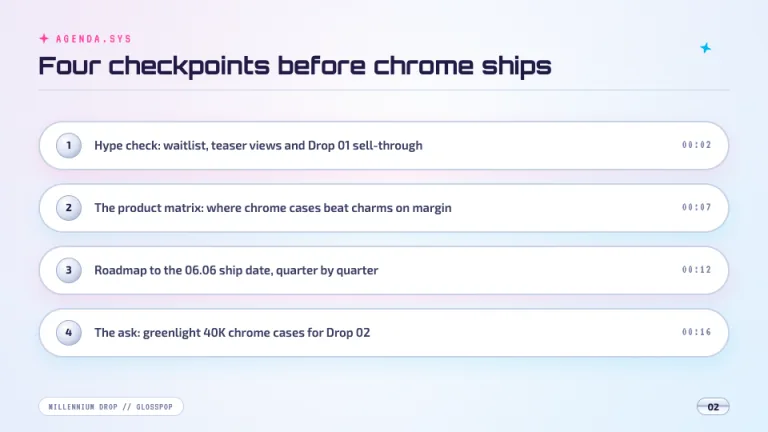
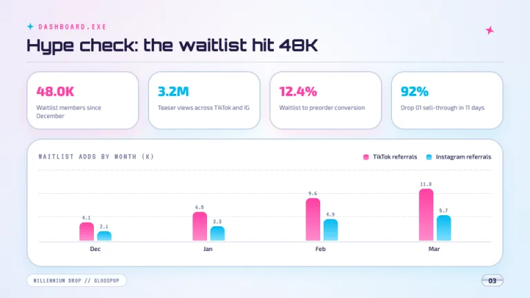
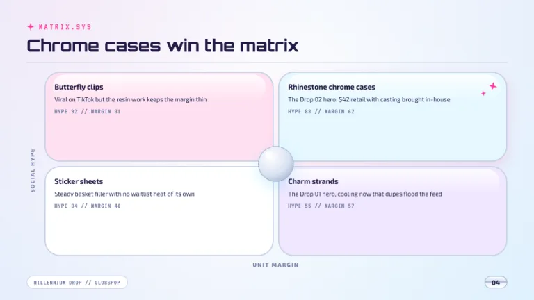
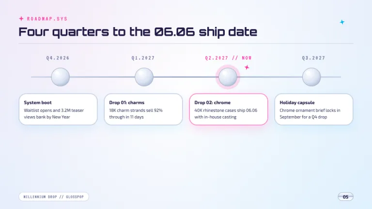
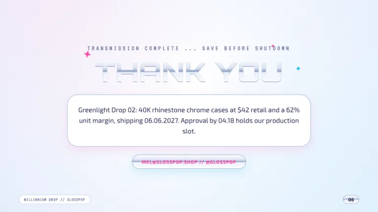

[← All prompts](../README.md) · [Live site](https://slidespeak.co/slide-design-prompts) · [SlideSpeak](https://slidespeak.co)

# Y2K

> Chrome dreams from the year 2000

A Y2K PowerPoint template look built from chrome-gradient headlines, airbrushed pink-and-cyan gradients, pixel sparkles and glossy bubble panels. Use it as a Y2K slides template prompt for product drops, lookbooks and any deck that should feel beamed in from the year 2000.

**Category:** Creative & portfolio &nbsp;·&nbsp; **Style:** Playful, Bold, Retro &nbsp;·&nbsp; **Mode:** Light &nbsp;·&nbsp; **Fonts:** Orbitron + Exo 2 + VT323

<table>
    <tr>
      <td align="center" width="33%"><br><sub>Title</sub></td>
      <td align="center" width="33%"><br><sub>Agenda</sub></td>
      <td align="center" width="33%"><br><sub>KPI dashboard</sub></td>
    </tr>
    <tr>
      <td align="center" width="33%"><br><sub>Chrome framework</sub></td>
      <td align="center" width="33%"><br><sub>Roadmap</sub></td>
      <td align="center" width="33%"><br><sub>Closing</sub></td>
    </tr>
</table>

## The prompt

Copy the prompt below into **ChatGPT**, **Claude**, or any AI chat — or grab the raw [`PROMPT.md`](./PROMPT.md). It asks what your presentation is about first, then applies the design to every slide.

```text
Create a presentation in the 'Y2K' theme, a chrome-and-bubblegum tribute to millennium-era design. Background: never flat, a radial gradient from white (#ffffff) into icy blue (#e6edfb) with a soft pink glow (#ffe0f1) in one corner and a faint cyan haze (#d8f4ff) in the other. Typography: 'Orbitron' for display, 'Exo 2' for all body copy in #3a3f63 at 15 to 18px with line-height 1.5, 'VT323' for kickers and value labels only. The signature is chrome type: Orbitron 800 uppercase headlines filled with linear-gradient(180deg, #ffffff 0%, #d9e2f2 38%, #8fa1c2 50%, #eaf0fb 54%, #ffffff 100%) via background-clip:text plus a 1px silver glow (#7c85a8), reserved for the title and closing slides. Content slides open with a VT323 uppercase kicker in #ff3fa4 beside a four-point pixel star built with CSS clip-path (12 to 28px, #ff3fa4 or #00b8f0, max 4 per slide), then an Orbitron 700 title at 30 to 38px in #221b45 over a 1px silver rule (#c8d2e6). Body content sits in white bubble panels, 24 to 32px radius, 2px #c8d2e6 borders, with a glossy top highlight for an inflated plastic look. Title slide: a giant chrome wordmark at 64 to 88px under a VT323 system-readout kicker like 'SYSTEM ONLINE ... 01.01.2000', sparkles around it, an Exo 2 chrome capsule pill for presenter and date. Agenda: capsule rows with chrome-circle number badges and VT323 timestamp tags. KPI slides: bubble stat tiles with big Orbitron numbers in #ff3fa4 or #00b8f0, plus div-built bar charts with vertical gradients (#ff3fa4 to #ff8ccb, then #00b8f0 to #7ee0ff), 8px rounded caps, dotted #c8d2e6 gridlines, VT323 value labels. Framework slides: a 2x2 of bubble quadrants tinted #ffe0f1, #e6f8ff, #f0e6ff and white with a central chrome orb with a white specular dot. Roadmaps: a 3px silver track with chrome-orb nodes, the current phase haloed in rgba(255,63,164,.18). Tables: #ffe0f1 header rows with Orbitron labels in #ff3fa4, white rows with 1px #c8d2e6 dividers, a cyan #e6f8ff highlight column. Footer: a VT323 deck-name pill bottom-left in #7c85a8 and a chrome capsule page number bottom-right; every shadow is a colored pink or cyan glow, never black. Strictly avoid: neon-on-black cyberpunk styling, vaporwave props such as sunset grids, Roman busts or palm trees, black drop shadows, body paragraphs in Orbitron or VT323, square-cornered flat panels, more than 4 pixel stars per slide, muddy brown, olive or beige tints, emoji stars instead of CSS shapes, real 2000s brand logos or trademarks, and chrome gradients on every heading.

Use this theme for my slides. Ask me what the presentation is about first, then apply the theme to every slide.
```

**[Open ChatGPT ↗](https://chatgpt.com/)** &nbsp;·&nbsp; **[Open Claude ↗](https://claude.ai/new)** &nbsp;·&nbsp; **[Generate a finished deck with SlideSpeak ↗](https://app.slidespeak.co/presentation?utm_source=github&utm_medium=referral&utm_campaign=slide-design-prompts)**

## Palette

| Role | Hex |
| --- | --- |
| Background | `#eef2fb` |
| Surface / panel | `#ffffff` |
| Border | `#c8d2e6` |
| Primary accent | `#ff3fa4` |
| Primary (soft tint) | `#ffe0f1` |
| Text on primary | `#ffffff` |
| Heading text | `#221b45` |
| Body text | `#3a3f63` |
| Muted text | `#7c85a8` |

**Chart series:** `#ff3fa4` `#00b8f0` `#8a2be2` `#9fabc6`

## Fonts

- **Orbitron** (heading, Google Fonts)
- **Exo 2** (supporting, Google Fonts)
- **VT323** (supporting, Google Fonts)

---

<sub>Part of [SlideSpeak Slide Design Prompts](../../README.md) · MIT licensed</sub>
